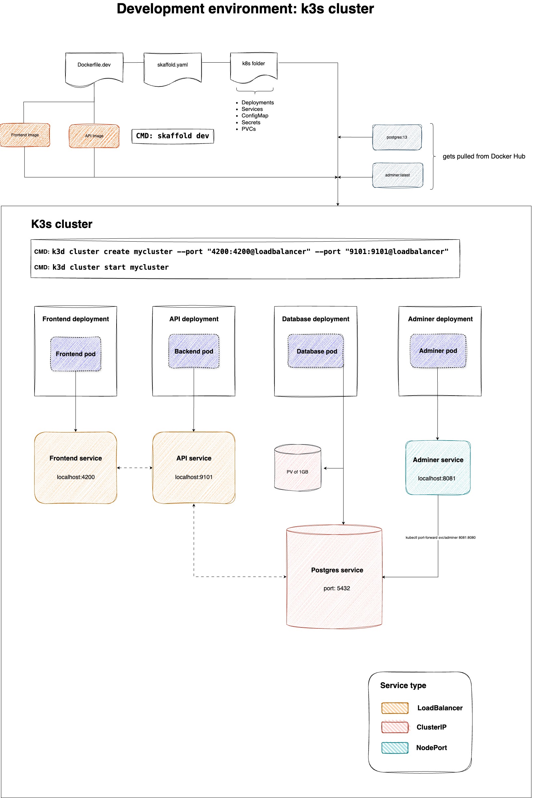

# Full Stack Platform with Docker and Kubernetes

## Project Overview

This project builds a platform for showcasing a range of applications.

### Current Setup

-   **Frontend**:

    -   **Tools**: Angular 18, managed within an Nx workspace.
    -   **Structure**: A main platform app that lazy-loads sub-apps, enabling a modular setup for different applications.

-   **Backend**:

    -   **Tools**: .NET 7 with Entity Framework.
    -   **Features**: REST API for platform services, user management, and role-based access.

-   **Database**: PostgreSQL

### Infrastructure

-   **Docker**: Manages containerized versions of the frontend, backend, and database.
-   **Kubernetes (K3s)**: Provides container orchestration for scalable application deployment.
    -   **kubectl**: Command-line tool for managing Kubernetes resources.
    -   **K3d**: Manages K3s clusters within Docker for lightweight local clusters.
    -   **Skaffold**: Handles continuous development workflows with Kubernetes.

### Application Architecture Diagrams

### K3s Handy Commands Cheat Sheet

| Command                                                          | Description                                  |
| ---------------------------------------------------------------- | -------------------------------------------- |
| `kubectl get services`                                           | List all services in the cluster             |
| `kubectl get pods`                                               | List all running pods                        |
| `kubectl describe pod <pod-name>`                                | Get detailed information on a specific pod   |
| `kubectl logs <pod-name>`                                        | View logs for a specific pod                 |
| `kubectl port-forward svc/<service> <local-port>:<service-port>` | Forward a port for local access to a service |
| `kubectl delete pod <pod-name>`                                  | Delete a specific pod (it will be restarted) |
| `kubectl apply -f <filename>.yaml`                               | Apply a YAML configuration to the cluster    |
| `kubectl delete -f <filename>.yaml`                              | Delete resources defined in a YAML file      |
| `k3d cluster create <name>`                                      | Create a new K3s cluster                     |
| `k3d cluster delete <name>`                                      | Delete an existing K3s cluster               |
| `skaffold dev`                                                   | Start Skaffold in development mode           |
| `skaffold run`                                                   | Deploy the application to the cluster        |
| `skaffold delete`                                                | Remove all Skaffold-managed resources        |
