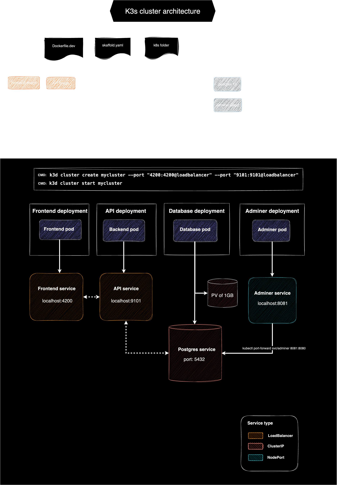

# eDB

## Project Overview

This project builds a platform for showcasing a range of applications within a central platform application.

---

### Setup

-   **Frontend**:

    -   **Tools**: **Angular 18**, managed within an **Nx** workspace.
    -   **Structure**:
        -   A main platform application that acts as a hub for various sub-applications.
        -   The platform application provides features for:
            -   **User authentication**: Login and registration.
            -   **Profile management**: Update user details, change settings, delete account and manage preferences.
            -   **RBAC**: User, Premium User, Admin
            -   **Conditional access to sub-applications**: Users can gain access to specific sub-applications using hopefully **feature flags**. (to be implemented)
            -   **Lazy-loading sub-applications**: The platform dynamically loads and displays sub-applications to improve performance and modularity.
        -   **API Calls**: Utilizes **TanStack Query** to efficiently fetch and manage data from the backend REST API.

-   **Backend**:

    -   **Tools**: .NET 7 with Entity Framework.
    -   **Features**: REST API for platform services, user management, and role-based access.

-   **Database**: PostgreSQL

---

### Infrastructure

-   **Docker**: Manages containerized versions of the frontend, backend, and database.
-   **Kubernetes (K3s)**: Provides container orchestration for scalable application deployment.
    -   **kubectl**: Command-line tool for managing Kubernetes resources.
    -   **K3d**: Manages K3s clusters within Docker for lightweight local clusters.
    -   **Skaffold**: Handles continuous development workflows with Kubernetes.

---

### Application Architecture Diagrams

---

### K3s Handy Commands Cheat Sheet

| Command                                                          | Description                                  |
| ---------------------------------------------------------------- | -------------------------------------------- |
| `kubectl get services`                                           | List all services in the cluster             |
| `kubectl get pods`                                               | List all running pods                        |
| `kubectl describe pod <pod-name>`                                | Get detailed information on a specific pod   |
| `kubectl logs <pod-name>`                                        | View logs for a specific pod                 |
| `kubectl port-forward svc/<service> <local-port>:<service-port>` | Forward a port for local access to a service |
| `kubectl delete pod <pod-name>`                                  | Delete a specific pod (it will be restarted) |
| `kubectl apply -f <filename>.yaml`                               | Apply a YAML configuration to the cluster    |
| `kubectl delete -f <filename>.yaml`                              | Delete resources defined in a YAML file      |
| `k3d cluster create <name>`                                      | Create a new K3s cluster                     |
| `k3d cluster delete <name>`                                      | Delete an existing K3s cluster               |
| `skaffold dev`                                                   | Start Skaffold in development mode           |
| `skaffold run`                                                   | Deploy the application to the cluster        |
| `skaffold delete`                                                | Remove all Skaffold-managed resources        |

---

### Nx Handy Commands Cheat Sheet

| Command                          | Description                                                                |
| -------------------------------- | -------------------------------------------------------------------------- |
| `nx serve <project>`             | Serve the application for development (e.g., `nx serve platform-app`).     |
| `nx build <project>`             | Build the specified project (e.g., `nx build platform-app`).               |
| `nx test <project>`              | Run tests for a specific project (e.g., `nx test platform-app`).           |
| `nx lint <project>`              | Lint the specified project (e.g., `nx lint platform-app`).                 |
| `nx affected:build`              | Build projects affected by the last changes.                               |
| `nx affected:lint`               | Lint all projects affected by the last changes.                            |
| `nx affected:test`               | Run tests on projects affected by the last changes.                        |
| `nx generate <schematic> <name>` | Generate a new file or module (e.g., `nx g component my-component`).       |
| `nx migrate latest`              | Update Nx and its dependencies to the latest version.                      |
| `nx dep-graph`                   | Visualize the dependency graph of the workspace.                           |
| `nx run-many --target=<target>`  | Run a target (like `build` or `test`) for multiple projects.               |
| `nx format:write`                | Format all code in the workspace.                                          |
| `nx format:check`                | Check if the workspace code is formatted properly.                         |
| `nx affected --target=<target>`  | Run a specific target (e.g., `build`, `test`) on affected projects.        |
| `nx reset`                       | Clear the Nx cache and reset the workspace state.                          |
| `nx list`                        | List all available Nx plugins and capabilities in the workspace.           |
| `nx report`                      | Show a detailed report of the current Nx workspace setup.                  |
| `nx storybook <project>`         | Run Storybook for the specified project (e.g., `nx storybook ui-library`). |
