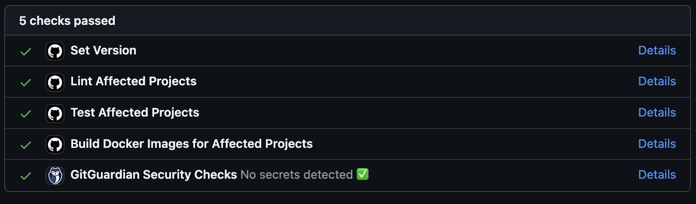
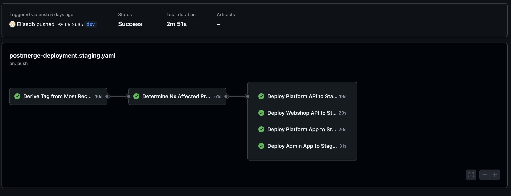
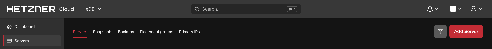
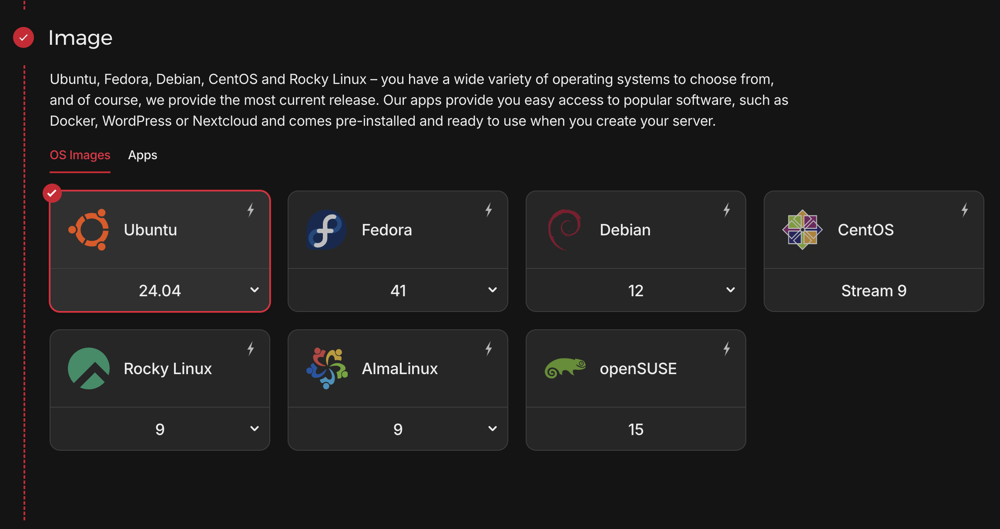
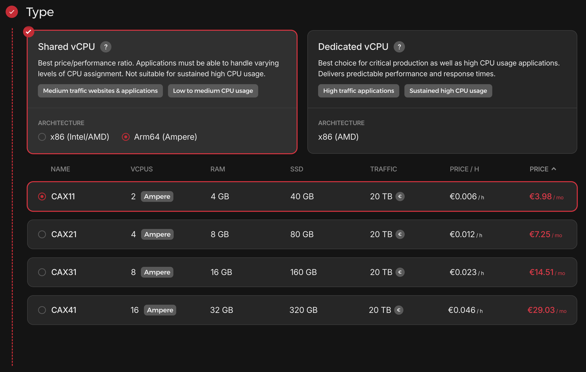
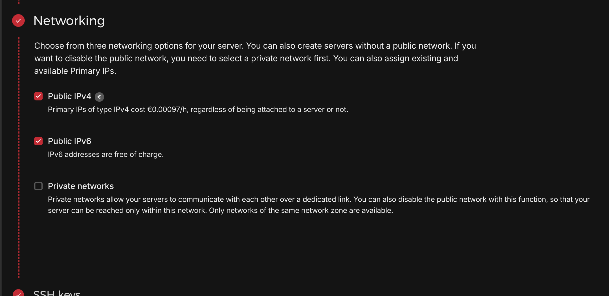
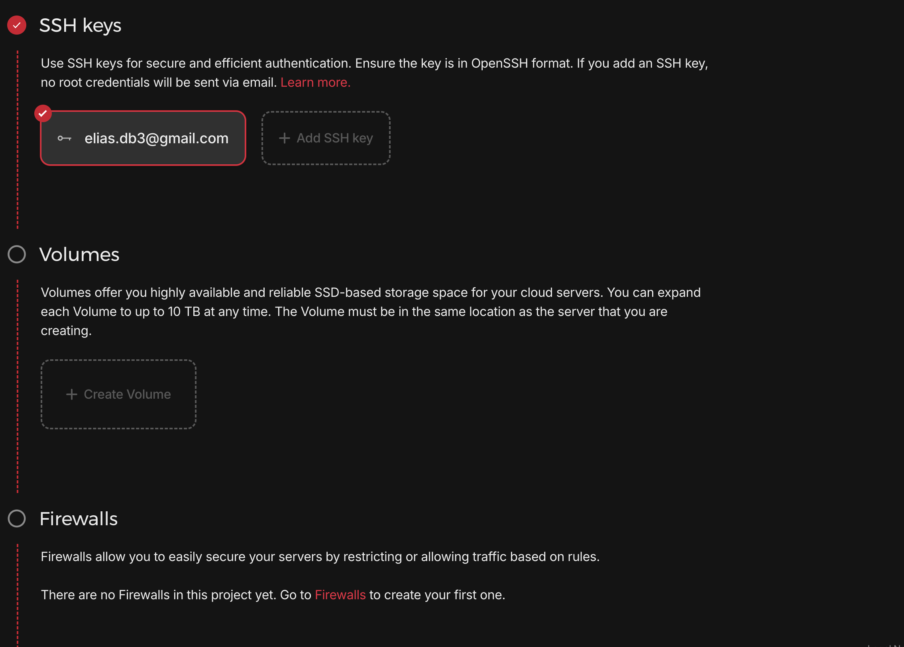
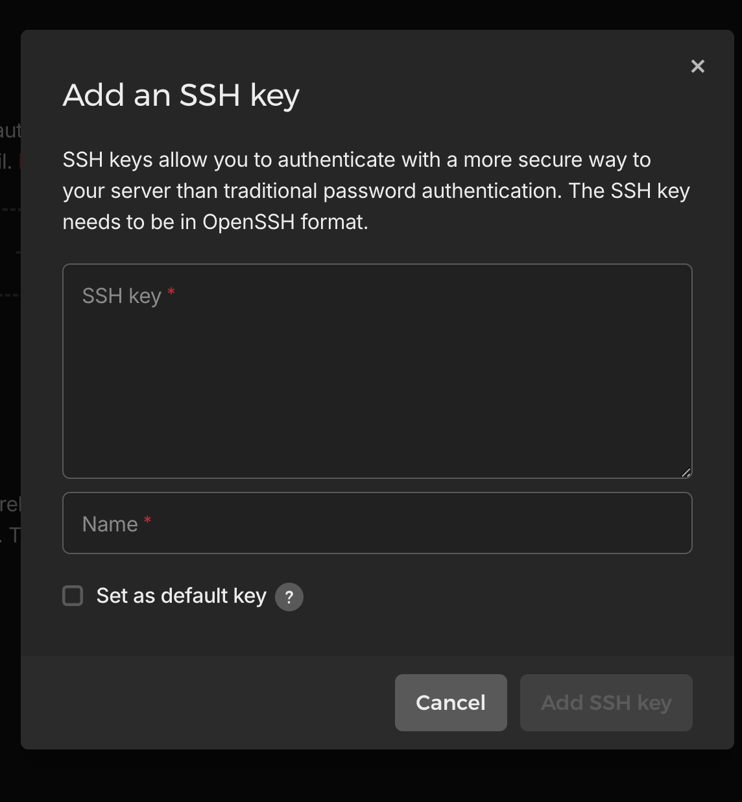

# eDB

## Documentation

-   [1. Project Goal](#1-project-goal)
-   [2. In Depth](#2-in-depth)
    -   [Client-Server Interaction](#client-server-interaction)
    -   [Critical Rendering Path (CRP)](#critical-rendering-path-crp)
    -   [The Event Loop](#the-event-loop)
-   [3. Setup](#3-setup)
    -   [Client](./docs/client.docs.md)
    -   [API](./docs/api.docs.md)
-   4. Environments
    -   [Development](./docs/dev-env.docs.md)
    -   [Staging & Production](./docs/staging-prod.docs.md)
-   [5. CI/CD](#5-cicd)
-   [6. Database](#6-database)
-   [7. VPS](#7-vps)
    -   [What is a VPS?](#71-what-is-a-vps)
    -   [Setting up a VPS with Hetzner](#72-setting-up-a-vps-with-hetzner)
-   [8. Project Management and Documentation](#8-project-management-and-documentation)
    -   [Jira](#81-jira)
    -   [Tags and releases](#82-tags-and-releases)
    -   [Confluence](#83-confluence)
-   [9. Handy Commands Cheat Sheet](#9-handy-commands-cheat-sheet)
    -   [General Commands](#91-general-commands)
    -   [Database Management Commands](#92-database-management-commands)
-   [10. Achieved Goals](#10-achieved-goals)
-   [11. TLDR: All Tools Used](#11-tldr-all-tools-used)
-   [12. Tools I'm working towards using](#12-tools-im-working-towards-using)

---

## 1. Project Goal

I am building a platform housing multiple applications. Users can make an account, subscribe to the apps and launch them.

## 2. In Depth

### Client-Server Interaction

Below you see a visual representation of the request-response model. Also mentioned protocols used and general information about headers.

### Critical Rendering Path (CRP)

Illustrated roughly what's going on in the CRP in a framework-agnostic way. The CRP is responsible for turning HTML, CSS, and JavaScript into pixels on the screen.

-   Parsing HTML → DOM (Document Object Model)
-   Parsing CSS → CSSOM (CSS Object Model)
-   Executing JavaScript (which may modify the DOM and CSSOM)
-   Creating the Render Tree (DOM + CSSOM)
-   Layout Calculation (determining positions and sizes)
-   Painting (filling pixels)
-   Compositing (layering elements for final rendering)

### The Event Loop

The event loop is the mechanism that JavaScript uses to handle asynchronous operations efficiently, ensuring that the single-threaded JavaScript runtime remains non-blocking.

## 3. Setup

This project uses Nx to efficiently manage multiple applications and shared libraries within a monorepo structure. Nx provides several key advantages:

### 🚀 **Why Use Nx?**

1. **Modular Architecture** – Nx helps divide the project into separate **apps** and **reusable libraries**, promoting maintainability and scalability.
2. **Efficient CI/CD** – With `nx affected`, only the changed parts of the codebase are rebuilt and tested, making the CI process **faster and more efficient**.
3. **Code Sharing** – Shared libraries eliminate code duplication by allowing different applications to **reuse UI components, utilities, and services**.
4. **Better Developer Experience** – Nx provides **powerful CLI tools**, **caching**, and **dependency graph visualization**, making development more streamlined.
5. **Optimized Builds** – Nx uses smart caching and incremental builds, ensuring that only necessary files are compiled, reducing build times.
6. **Consistent Tooling** – It enforces best practices by integrating with Angular, React, TypeScript, Jest, ESLint, Storybook, and other tools seamlessly.

By leveraging Nx, this monorepo allows for a more structured, scalable, and optimized development workflow, making it easier to maintain and extend over time.

Initially I used this only for the frontend. Using the `@nx-dotnet/core` package I was able to get my frontend and backend code together in this one codebase.

---

## 4. Environments

## 5. CI/CD

To smoothly update my staging and production environments, I have built several pipelines. This is how it goes:

**Creating a branch**

Checkout dev branch and pull latest code. Create a feature-branch locally, make changes and open a PR to compare your branch to the dev branch.

**Opening a PR: pre-merge checks**

When you open the PR, a pre-merge pipeline will attempt to lint, test and build only the affected code. It will also push Docker images to Docker Hub. When these checks pass, you can then safely merge to dev branch to automatically start deployment to staging.

**Deploying to staging: post-merge deployment**

After all checks pass and you have merged successfully, a pipeline will run deploying the build to a staging environment that mimics production.

**URLs**:

-   https://app.staging.eliasdebock.com
-   https://app.staging.eliasdebock.com/admin
-   https://api.staging.eliasdebock.com

**Opening a second PR: pre-merge checks**

After you merged to the dev branch, you can proceed to make another PR. This time to push to production, to merge with the main branch. A pre-merge pipeline will running the same linting, testing and building process as the pre-merge checks for staging. After those pass you can merge to main branch.

**Deploying to production: post-merge deployment**

You can then click the button to merge to main branch. This will trigger the final pipeline to deploy to production.

**URLs**:

-   https://app.eliasdebock.com
-   https://app.eliasdebock.com/admin
-   https://api.eliasdebock.com

Below is a visual representation of all the pipelines running in the project.

You can also see this run live on GitHub, under the Actions tab:

---

## 6. Database

**Database**: PostgreSQL

---

## 7. VPS

### 7.1 What is a VPS?

A **Virtual Private Server (VPS)** is a virtualized environment that provides dedicated resources on a shared physical server. It offers a balance between cost, performance, and control, making it a popular choice for hosting applications and services.

#### Key Features of a VPS

-   **Dedicated Resources**: Allocated CPU, RAM, and storage that are exclusive to your VPS.
-   **Root Access**: Full control over the server to customize it as needed.
-   **Performance Isolation**: Other users on the same physical server do not impact your performance.
-   **Scalability**: Easily upgrade or downgrade resources based on your needs.
-   **Cost-Effective**: More affordable than a dedicated server, with similar customization and isolation benefits.

> **Note:** While the physical hardware is shared, the virtualization layer ensures resource isolation and predictable performance.

#### 7.2 Setting up a VPS with Hetzner

#### Step 0: Setting up your account

-   Create an account on [Hetzner](https://accounts.hetzner.com/signUp).

-   Navigate to your [account section](https://console.hetzner.cloud/projects).

#### Step 1: Configure server on Hetzner

Under the 'Servers' tab you should find a button to add a server to your account. Let's go over the easy steps first needed to configure our server. It's pretty straight forward.

You will need to set

-   #### Location

    Location of server.
    

-   #### Image OS:

    This project runs on Ubuntu.
    

-   #### Type:

    I'm on shared ARM64 vCPUs.
    

-   #### Networking:

    

#### Step 2: Generating an SSH key

Run following command on your machine:

`ssh-keygen -t rsa -b 4096 -C "your_email@example.com" -f /path/to/your/custom_key_name`

-   **-t rsa**: Specifies the type of key (RSA).
-   **-b 4096**: Sets the key size to 4096 bits for better security.
-   **-C "your_email@example.com"**: Adds a comment, typically your email address.
-   **-f /path/to/your/custom_key_name**: Specifies the file path and name for the key.

You can add an optional passphrase. Skip or add one for more security.

#### Step 3: Retrieving the public key

After generating the key, the private key will be at /path/to/your/custom_key, and the public key will be at /path/to/your/custom_key.pub.

To retrieve the public key:
`cat /path/to/your/custom_key.pub`
Copy the output to use in your cloud-config or in the setup of the server as seen below here.

#### Step 4: Volumes

You can add volumes to store data. This is needed if you want the data of your database to be persistent.

#### Step 5: Cloud config and server name

Cloud-init is a powerful tool used for automating the initial setup and configuration of cloud servers during their first boot.
[This article](https://community.hetzner.com/tutorials/basic-cloud-config) takes you step by step in the setup of a cloud-init script. The script will handle users set up, SSH keys and permissions, install packages, run custom scripts, configure firewalls or securing SSH.

## 8. Project Management and Documentation

### 8.1 Jira

Jira is used as a central tool to organize, track, and manage work. It supports various issue types for different kinds of work items, helps structure tasks under epics, and facilitates agile sprint planning and execution.

---

#### Issue types

Jira provides different issue types to categorize work, each serving a unique purpose. Understanding these types helps in organizing and managing issues effectively:

**Epics:**

-   **Purpose:** Large bodies of work that can be broken down into smaller tasks (stories, tasks, spikes).
-   **Usage:** In this project, four main epics categorize all work:
    -   **Project Management:** Organizing work, planning sprints, refining backlog items, and improving management processes.
    -   **Frontend:** Focusing on user interface, user experience, data visualization, responsiveness, testing, and code quality improvements.
    -   **Backend:** Pertaining to API development, code refactoring, testing, architectural decisions, and infrastructure improvements.
    -   **DevOps:** Covering CI/CD pipelines, server management, security, infrastructure automation, and related research (spikes) for deployment tools and strategies.

**Stories:**

-   **Purpose:** Represent user-centric features or requirements from an end-user’s perspective.
-   **Usage:** Capture specific functionalities or enhancements that deliver value to users. For example: “As an admin, I want to see graphs on the dashboard so that I can analyze data trends easily.”

**Tasks:**

-   **Purpose:** Represent technical or operational work that doesn’t directly translate into a user feature but is necessary for project progress.
-   **Usage:** Used for maintenance, setup, refactoring, and other work items like “Setup My First Sprint” or “Refactor Goals and Unresolved Questions into Jira Tickets.”

**Spikes:**

-   **Purpose:** Time-boxed research or investigation tasks to explore solutions, reduce uncertainty, or gather information.
-   **Usage:** Used for exploring best practices, evaluating new tools, or researching architectural approaches. Spikes are labeled as such for easy identification.

---

#### Setting up a sprint

**1. Prepare your backlog:**  
Ensure that your backlog is prioritized and contains refined stories, tasks, and spikes linked to their respective epics.

**2. Create a new sprint:**  
Navigate to the **Backlog** view on your Scrum board and click on **“Create sprint”** at the top of the backlog. A new sprint container will appear, ready to be populated with issues.

**3. Select issues for the sprint:**  
Drag and drop high-priority issues from the backlog into the new sprint container. Choose issues that align with the sprint goal and team capacity, maintaining a balance of feature development, technical tasks, and research activities.

**4. Define sprint goals and timeline:**  
Optionally, edit the sprint details to set a clear sprint goal that describes what you aim to achieve. Set start and end dates, and determine the sprint duration.

**5. Start the sprint:**  
Once the sprint is populated and goals are defined, click **“Start sprint”**. Jira automatically creates a Scrum board for the sprint if one isn’t already configured. This board visualizes the sprint backlog, in-progress tasks, and completed work.

---

#### Working with the Jira Board

-   **Automatic board creation:**  
    When a sprint is started, Jira generates a Scrum board that reflects the sprint’s issues. The board typically includes columns (e.g., To Do, In Progress, Done) that represent the workflow stages.

-   **Using the board:**

    -   **Visualize progress:** Team members can drag issues across columns as work progresses.
    -   **Daily standups:** Use the board during standups to discuss what’s in progress, what’s completed, and identify blockers.
    -   **Update issues:** Team members update issue statuses, log work, and add comments directly on the board to keep everyone informed.

-   **Completing the Sprint:**  
    At the end of the sprint, review completed work on the board. Use Jira’s **“Complete sprint”** feature to close the sprint, move unfinished tasks back to the backlog or the next sprint, and plan for future sprints.

### 8.2 Tags and releases

At the end of each sprint, there will be a new version to be settled upon. This will become the new tag made in the pipeline to tag the Docker image and also will be used in the release notes to publish a release on GitHub from.

Here is an [overview](https://github.com/Eliasdb/eDB/releases) of all releases so far.

### 8.3 Confluence

I intend to migrate this README to Confluence pages. More on this at a later time.
URL to [Confluence space](https://metanoi4.atlassian.net/wiki/spaces/eDB/overview). Only visible if you are part of the team.

## 9. Handy Commands Cheat Sheet

### 9.1 General Commands

| Command                                                          | Description                                  |
| ---------------------------------------------------------------- | -------------------------------------------- |
| `kubectl get services`                                           | List all services in the cluster             |
| `kubectl get pods`                                               | List all running pods                        |
| `kubectl describe pod <pod-name>`                                | Get detailed information on a specific pod   |
| `kubectl logs <pod-name>`                                        | View logs for a specific pod                 |
| `kubectl port-forward svc/<service> <local-port>:<service-port>` | Forward a port for local access to a service |
| `kubectl delete pod <pod-name>`                                  | Delete a specific pod (it will be restarted) |
| `kubectl apply -f <filename>.yaml`                               | Apply a YAML configuration to the cluster    |
| `kubectl delete -f <filename>.yaml`                              | Delete resources defined in a YAML file      |
| `k3d cluster create <name>`                                      | Create a new K3s cluster                     |
| `k3d cluster delete <name>`                                      | Delete an existing K3s cluster               |
| `k3d cluster start <name>`                                       | Start an existing K3s cluster                |
| `skaffold dev`                                                   | Start Skaffold in development mode           |
| `skaffold run`                                                   | Deploy the application to the cluster        |
| `skaffold delete`                                                | Remove all Skaffold-managed resources        |

### 9.2 Database Management Commands

| Command                                                 | Description                                                           |
| ------------------------------------------------------- | --------------------------------------------------------------------- |
| `kubectl port-forward svc/<postgres-service> 5432:5432` | Forward PostgreSQL service to localhost for local access              |
| `psql -h localhost -p 5432 -U <username> -d <database>` | Connect to PostgreSQL database locally                                |
| `CREATE DATABASE <database>;`                           | Create a new database inside PostgreSQL                               |
| `\l`                                                    | List all databases                                                    |
| `\c <database>`                                         | Switch to a specific database                                         |
| `\dt`                                                   | List all tables in the current database                               |
| `kubectl get pods -n <namespace>`                       | Check if the database pod is running                                  |
| `kubectl logs <pod-name> -n <namespace>`                | View logs for the database pod to troubleshoot issues                 |
| `dotnet ef migrations add <MigrationName>`              | Create a new migration to modify the database schema                  |
| `dotnet ef database update`                             | Apply migrations to update the database schema                        |
| `kubectl delete pod <postgres-pod-name> -n <namespace>` | Restart the PostgreSQL pod if it’s stuck or needs to be reinitialized |
| `SELECT pg_terminate_backend(pg_stat_activity.pid)`     | Terminate connections to a specific database (see below for full SQL) |

---

## 10. Achieved Goals

-   [x] Containerizing applications (Dockerfiles)
-   [x] Development environment (k3s cluster using k3d managed with Skaffold OR Nx)
-   [x] Staging environment (k3s cluster on VPS)
-   [x] Production environment (k3s cluster on VPS)
-   [x] CI/CD pipelines for production and staging, with pre-merge checks and post-merge deployment (self-hosted ARM Github Actions runner on VPS).
-   [x] Documentation
-   [x] Layered Modular Architecture for Client and .NET API
-   [x] Authentication with self-hosted Keycloak (login - register - profile - sessions - ...)
-   [x] Added Demo App #1 Webshop

## 11. TLDR: All Tools Used

**DevOps**

-   [x] **Docker**: Docker Compose - Docker Desktop - Docker Hub - Dockerfiles - Docker images - multi-stage
-   [x] **Kubernetes**: k3d - k3s - kubectl - Ingress - Deployments - Services - Pods - Secrets - Configmaps - YAML - Certificates - NGINX Controller
-   [x] **Servers**: Linux (Ubuntu) - VPS
-   Static file web server → NGINX
-   API web server → .NET Web API - Laravel PHP-FPM
-   Database server → Postgres
-   Authentication server → Keycloak
-   shell scripts (`wait-for-postgres.sh` / `entrypoint.sh`)
-   [x] **CI/CD**: Github Actions - GitFlow - `nx affected` - yamllint

**Monorepo**

-   [x] **Nx**: apps - libs - Nx generators/scaffolding commands - `nx affected` - modular layered architecture

**Auth**

-   [x] **Authentication**: Keycloak - keycloak-js

**Client**

-   [x] **Language**: Typescript
-   [x] **Node Package Manager**: pnpm
-   [x] **Angular**: (Standalone) Components - Services - RxJS - Signals - Interceptors - Guards - Reactive Forms
-   [x] **Testing**: Vitest - Storybook
-   [x] **Linting + formatting**: Prettier - ESLint
-   [x] **UI**: HTML - SCSS - Tailwind - Carbon Design System - Angular Material - FontAwesome
-   [x] **API Integration**: TanStack Query

**API**

-   [x] **Language**: C# - PHP
-   [x] **Package Manager**: NuGet - Composer
-   [x] **Frameworks**:
    -   [x] **.NET**: Controllers - Services - Repositories - Entities - DTOs - Extensions - Interfaces - MappingProfiles - Middleware (exception middleware) - Migrations - .NET CLI - Fluent API - JWT - CORS - Attributes - DbContext - .NET SDK
    -   [x] **Laravel**: Controllers - Models - Requests - Resources - Collections - PHP Artisan CLI - Middleware - Migrations - Seeders - Factories
-   [x] **ORM**: EF - Doctrine
-   [x] **Testing**: xUnit - Moq - Postman
-   [x] **Formatting**: dotnet format
-   [x] **API Documentation**: Swagger
-   [x] **Object Mapper**: Automapper

## 12. Tools I'm working towards using

**DevOps**

-   [ ] **Monitoring & analytics**: Grafana, Prometheus
-   [ ] **Secrets Management**: HashiCorp Vault, SealedSecrets, External Secrets Operator
-   [ ] **Logging & Distributed Tracing**: ELK Stack (Elasticsearch, Logstash, Kibana), Fluentd, Loki
-   [ ] **Cluster Management**: ArgoCD (GitOps), Helm, Kustomize
-   [ ] **Hotfixes and Feature Flags**
-   [ ] **Load balancing**
-   [ ] **Caching & Performance Optimization**: Nx Cloud, TurboRepo
-   [ ] **Azure**
    -   [ ] **Azure Kubernetes Service (AKS)** – Managed Kubernetes instead of K3s
    -   [ ] **Azure Container Registry (ACR)** – Store and manage Docker images
    -   [ ] **Azure DevOps Pipelines** – Alternative to GitHub Actions
    -   [ ] **Azure Resource Manager (ARM) / Terraform / Bicep** – Infrastructure as Code (IaC)
    -   [ ] **Azure App Service** – Deploy apps without full Kubernetes
    -   [ ] **Azure Functions** – Serverless execution for background jobs

**Client**

-   [ ] **Microfrontends**: Module Federation
-   [ ] **End-to-End Testing**: Cypress, Playwright
-   [ ] **State Management**: NgRx, Akita, SignalStore
-   [ ] **Error Handling & Monitoring**: Sentry, PostHog
-   [ ] **Accessibility (a11y) Testing**: Axe DevTools, Lighthouse

**API**

-   [ ] **Architecture**: Event Driven Architecture, Domain Driven Architecture
-   [ ] **Background Jobs & Messaging**: Hangfire, MassTransit, MediatR, RabbitMQ, Kafka
-   [ ] **Caching**: Redis
-   [ ] **Rate Limiting & API Gateway**: Ocelot, YARP, Envoy
-   [ ] **Feature Flags & Config Management**: Unleash, ConfigCat
