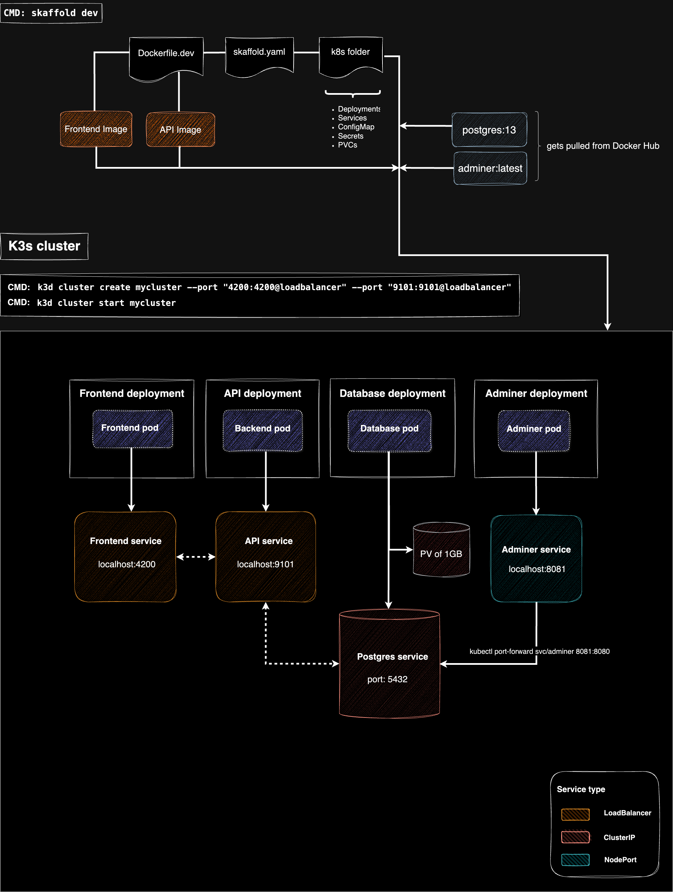
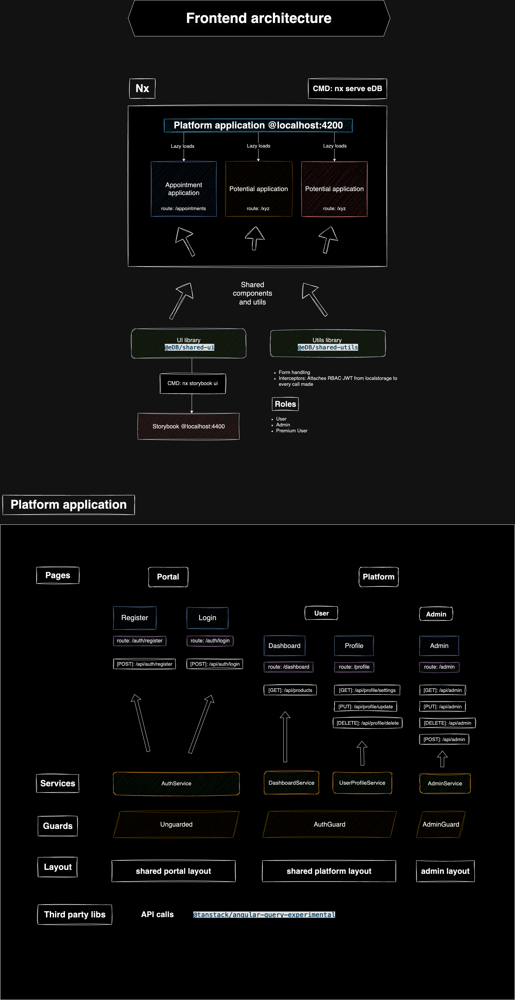
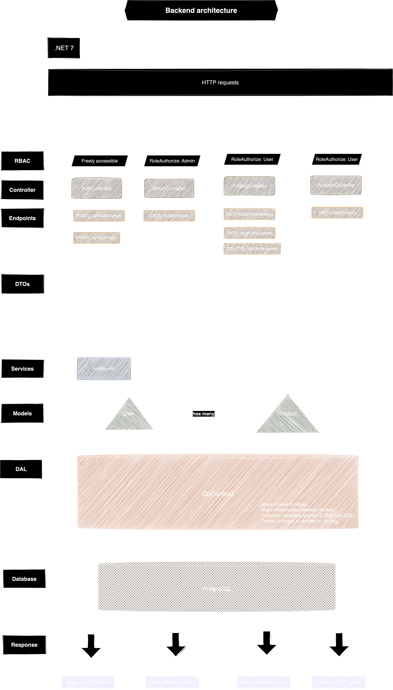

# eDB

## Table of Contents

-   [1. Project Goal](#1-project-goal)
-   [2. Setup](#2-setup)
    -   [2.1 Frontend](#21-frontend)
        -   [2.1.1 Platform Application Features](#211-platform-application-features)
        -   [2.1.2 Shared Libraries](#212-shared-libraries)
        -   [2.1.3 Storybook](#213-storybook)
    -   [2.2 Backend](#22-backend)
    -   [2.3 Database](#23-database)
-   [3. Environments](#3-environments)
    -   [3.1 Development](#31-development)
        -   [3.1.1 Architecture Diagram](#311-architecture-diagram)
        -   [3.1.2 Spinning up a cluster locally](#312-spinning-up-a-cluster-locally)
            -   [Step 0: Prerequisites](#step-0-prerequisites)
            -   [Step 1: Create and start a k3d cluster](#step-1-create-and-start-a-k3d-cluster)
            -   [Step 2: Create Dockerfiles for Your Services](#step-2-create-dockerfiles-for-your-services)
            -   [Step 3: Create Kubernetes Manifests](#step-3-create-kubernetes-manifests)
            -   [Step 4: Run Skaffold for Local Development](#step-4-run-skaffold-for-local-development)
    -   [3.2 Production](#32-production)
        -   [3.2.1 Architecture Diagram](#321-architecture-diagram)
        -   [3.2.2 CI/CD Pipeline](#322-cicd-pipeline)
        -   [3.2.3 CI/CD Flow](#323-cicd-flow)
    -   [3.3 Frontend architecture](#33-frontend-architecture)
        -   [3.3.1 Nx and Angular](#331-nx-and-angular)
    -   [3.3 Backend architecture](#3-backend-architecture)
        -   [3.3.1 .NET architecture](#31-net-architecture)
-   [5. K3s Handy Commands Cheat Sheet](#5-k3s-handy-commands-cheat-sheet)
    -   [5.1 General Commands](#51-general-commands)
    -   [5.2 Database Management Commands](#52-database-management-commands)

---

## 1. Project Goal

Building a platform housing multiple applications.

## 2. Setup

### 2.1 Frontend

**Tools**: **Angular 18**, managed within an **Nx** workspace.

**Platform Application Features**:

-   **User Management**:
    -   Login and registration.
    -   Profile updates, account deletion, and preference management.
-   **Role-Based Access Control (RBAC)**:
    -   User roles: User, Premium User, Admin.
    -   Conditional access to sub-applications based on roles and feature flags (to be implemented). - **Application Modularity**: - Lazy-loading sub-applications for improved performance and scalability.
-   **API Integration**:
    -   Utilizes **TanStack Query** to efficiently fetch and manage data from the backend REST API.

**Shared Libraries**:

-   **UI Library**: Built using **Carbon Design System**. Provides reusable components such as buttons, modals, and input fields to ensure consistent design across applications.
-   **Utils Library**: Contains shared utility functions, services, and helpers to promote DRY (Don't Repeat Yourself) principles.

**Storybook**: Used to document and visually test components from the shared UI library, ensuring consistency and reusability across the platform.

### 2.2 Backend

**Tools**: .NET 7 with Entity Framework.
**Features**: REST API for platform services, user management, and role-based access.

### 2.3 Database

**Database**: PostgreSQL

---

## 3. Environments

### 3.1 Development

I am using **k3d**, which wraps my **k3s** Kubernetes distribution inside **Docker** containers. **k3s** is a lightweight Kubernetes distribution that allows me to orchestrate containers for scalable application deployment. I use **Skaffold** to manage my Kubernetes manifests, build Docker images and deploy them to my local k3d cluster. Skaffold also pulls any configured images, such as **PostgreSQL** and **Adminer**, enabling a complete local development environment.

#### 3.1.1 Architecture Diagram



#### 3.1.2 Spinning up a cluster locally

##### Step 0: Prerequisites

If you want to run this project locally, make sure you have the following installed:

1. **Docker**:  
   Download and install Docker from [https://www.docker.com/products/docker-desktop](https://www.docker.com/products/docker-desktop).

2. **k3d**:  
   Install k3d, a lightweight wrapper for running k3s in Docker.  
   Installation guide: [https://k3d.io/#installation](https://k3d.io/#installation)

    For example, using `brew` on macOS:

    ```bash
    brew install k3d
    ```

3. **kubectl**:  
   Install `kubectl`, the Kubernetes CLI tool, to manage the cluster.  
   Installation guide: [https://kubernetes.io/docs/tasks/tools/](https://kubernetes.io/docs/tasks/tools/)

4. **Skaffold**:  
   Download and install Skaffold for managing Kubernetes manifests and local development.  
   Installation guide: [https://skaffold.dev/docs/install/](https://skaffold.dev/docs/install/)

    For example, using `brew` on macOS:

    ```bash
    brew install skaffold
    ```

##### Step 1: Create and start a k3d cluster

Create a new k3d cluster and specify ports to expose the services running inside the cluster. These ports will be accessible from your host machine.

**Command to create the cluster:**

```bash
k3d cluster create mycluster --port "3200:3200@loadbalancer" --port "9101:9101@loadbalancer"
```

**Command to start the cluster:**

```bash
k3d cluster start mycluster
```

##### Step 2: Create Dockerfiles for Your Services

Create a `Dockerfile` for each service (e.g., `frontend` and `backend`).

##### Step 3: Create Kubernetes Manifests

Create Kubernetes manifests for all resources required by your application. These should include:

-   **Deployments**: Define how your frontend and backend applications will run, including resource limits and replicas.
-   **Services**: Expose your applications as `ClusterIP` or `LoadBalancer` types.
-   **ConfigMaps**: Store environment variables and other configurations.
-   **Secrets**: Store sensitive data securely (e.g., database credentials).
-   **Persistent Volumes (PVs) and Persistent Volume Claims (PVCs)**: Handle storage for services like PostgreSQL.

Ensure your manifests include the necessary annotations to work with k3d's local LoadBalancer and any ingress controllers you may use.

##### Step 4: Run Skaffold for Local Development

Use **Skaffold** to build and deploy your services automatically:

**Command:**

```bash
skaffold dev
```

This command will:

-   Build Docker images using your `Dockerfiles`.
-   Apply your Kubernetes manifests to the cluster.
-   Monitor your source code for changes and redeploy the services when updates are detected.

Once deployed, your frontend will be available at `http://localhost:3200` and your backend at `http://localhost:9101`. You can access these services via a browser or tools like Postman.

### 3.2 Production

#### 3.2.1 Architecture Diagram

#### 3.2.2 CI/CD Pipeline

This CI/CD pipeline is designed to automate the process of building, validating, and deploying applications to a **Hetzner CAX21 VPS** running a **k3s cluster**. It ensures seamless updates to the live environment by leveraging **GitHub Actions**. Whenever code is pushed to the `main` branch, the pipeline builds Docker images for the backend and frontend, validates Kubernetes manifests, and deploys updated services to the k3s cluster. The pipeline also includes steps to roll back in case of errors during deployment.

#### 3.2.3 CI/CD Flow

##### Trigger

-   The pipeline is triggered by a push to the `main` branch of the GitHub repository.

##### Preparation

-   Ensures that the job runs only for commits not made by the GitHub Actions bot.
-   Checks out the repository code with full commit history for accurate versioning.

##### Versioning

-   Automatically increments the application version using the total number of commits in the repository.
-   Sets a unique Docker image tag based on the computed version (e.g., `v1.0.<commit_count>-prod`).

##### Docker Setup

-   Configures **Docker Buildx** to build multi-platform Docker images (e.g., for ARM63).
-   Authenticates to Docker Hub using credentials stored as GitHub Secrets.

##### Build and Push Docker Images

-   Builds and pushes the Docker image for the backend service from the `api` directory.
-   Builds and pushes the Docker image for the frontend service from the `eDB` directory.

##### Kubernetes Configuration

-   Configures `kubectl` using the kubeconfig stored as a GitHub Secret to interact with the k3s cluster.
-   Validates access to the Kubernetes cluster by displaying cluster information.

##### Linting

-   Lints the Kubernetes YAML manifests for both the backend and frontend services to ensure they are properly formatted.

##### Update Kubernetes Manifests

-   Replaces placeholders in the Kubernetes deployment YAML files with the new Docker image tag to deploy the latest version of the services.

##### Validation

-   Performs a dry-run validation of the updated YAML files to ensure they are correct and will apply successfully to the cluster.

##### Deployment

-   Deploys the updated Kubernetes manifests to the k3s cluster using `kubectl apply`.
-   Monitors the rollout status of each deployment to ensure it succeeds.
-   Automatically rolls back the deployment if there are issues during the rollout.

##### Commit Updated Manifests

-   Commits the updated Kubernetes manifests with the new image tags back to the GitHub repository for record-keeping.

##### Push Changes

-   Pushes the committed changes to the `main` branch of the repository.

---

### 4.3 Frontend architecture

#### 4.3.1 Nx and Angular



### 4.4 Backend architecture

#### 4.4.1 .NET architecture



---

## 5. K3s Handy Commands Cheat Sheet

### 5.1 General Commands

| Command                                                          | Description                                  |
| ---------------------------------------------------------------- | -------------------------------------------- |
| `kubectl get services`                                           | List all services in the cluster             |
| `kubectl get pods`                                               | List all running pods                        |
| `kubectl describe pod <pod-name>`                                | Get detailed information on a specific pod   |
| `kubectl logs <pod-name>`                                        | View logs for a specific pod                 |
| `kubectl port-forward svc/<service> <local-port>:<service-port>` | Forward a port for local access to a service |
| `kubectl delete pod <pod-name>`                                  | Delete a specific pod (it will be restarted) |
| `kubectl apply -f <filename>.yaml`                               | Apply a YAML configuration to the cluster    |
| `kubectl delete -f <filename>.yaml`                              | Delete resources defined in a YAML file      |
| `k3d cluster create <name>`                                      | Create a new K3s cluster                     |
| `k3d cluster delete <name>`                                      | Delete an existing K3s cluster               |
| `skaffold dev`                                                   | Start Skaffold in development mode           |
| `skaffold run`                                                   | Deploy the application to the cluster        |
| `skaffold delete`                                                | Remove all Skaffold-managed resources        |

### 5.2 Database Management Commands

| Command                                                 | Description                                                           |
| ------------------------------------------------------- | --------------------------------------------------------------------- |
| `kubectl port-forward svc/<postgres-service> 5432:5432` | Forward PostgreSQL service to localhost for local access              |
| `psql -h localhost -p 5432 -U <username> -d <database>` | Connect to PostgreSQL database locally                                |
| `CREATE DATABASE <database>;`                           | Create a new database inside PostgreSQL                               |
| `\l`                                                    | List all databases                                                    |
| `\c <database>`                                         | Switch to a specific database                                         |
| `\dt`                                                   | List all tables in the current database                               |
| `kubectl get pods -n <namespace>`                       | Check if the database pod is running                                  |
| `kubectl logs <pod-name> -n <namespace>`                | View logs for the database pod to troubleshoot issues                 |
| `dotnet ef migrations add <MigrationName>`              | Create a new migration to modify the database schema                  |
| `dotnet ef database update`                             | Apply migrations to update the database schema                        |
| `kubectl delete pod <postgres-pod-name> -n <namespace>` | Restart the PostgreSQL pod if it’s stuck or needs to be reinitialized |
| `SELECT pg_terminate_backend(pg_stat_activity.pid)`     | Terminate connections to a specific database (see below for full SQL) |

---
