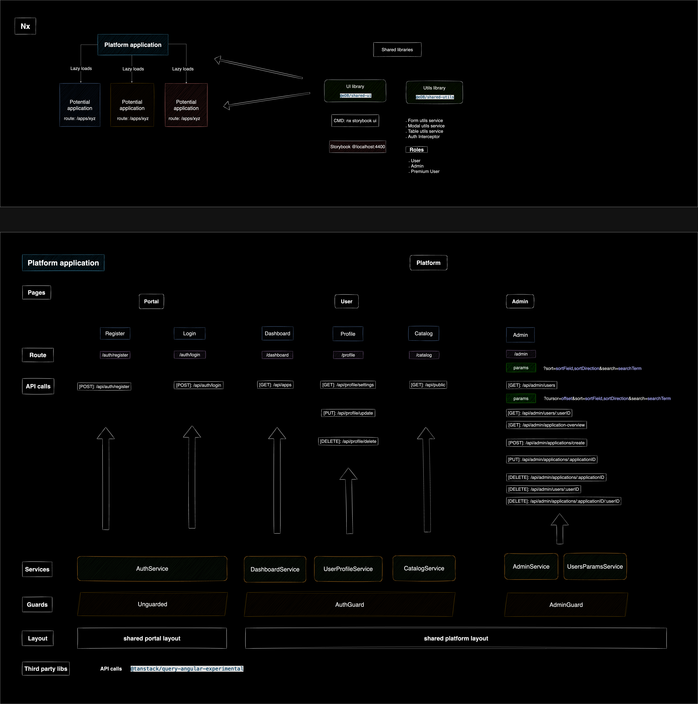
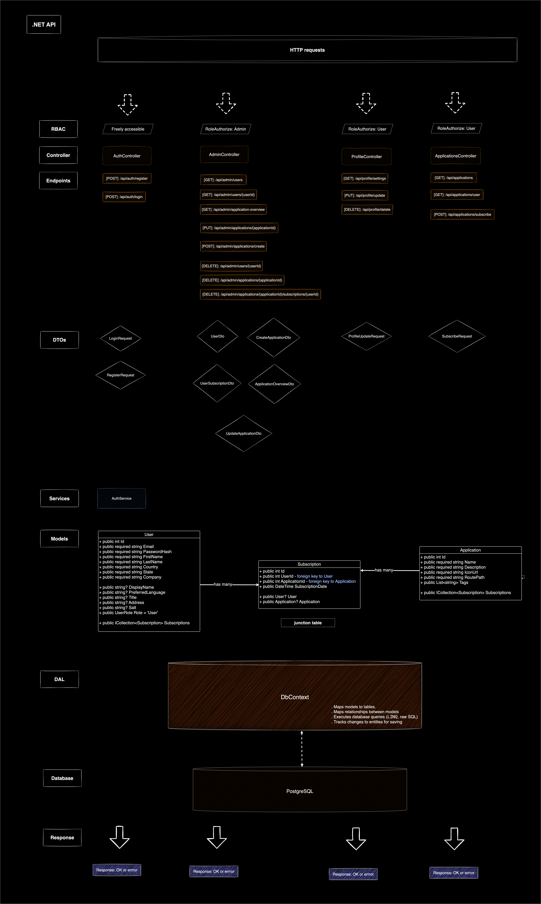
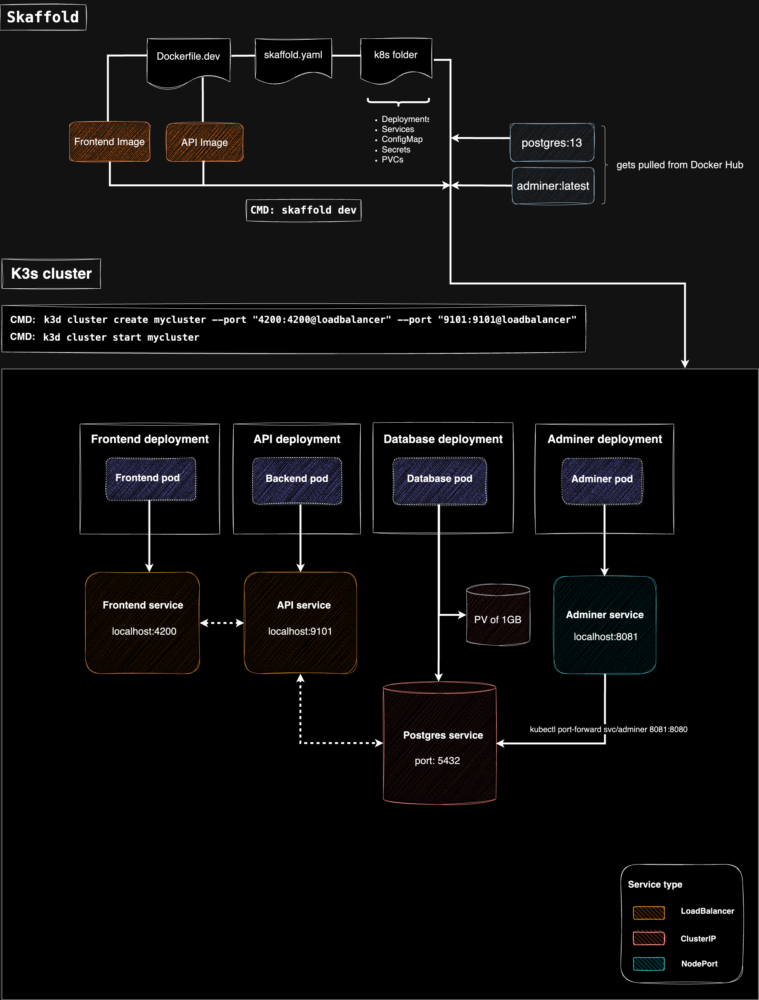
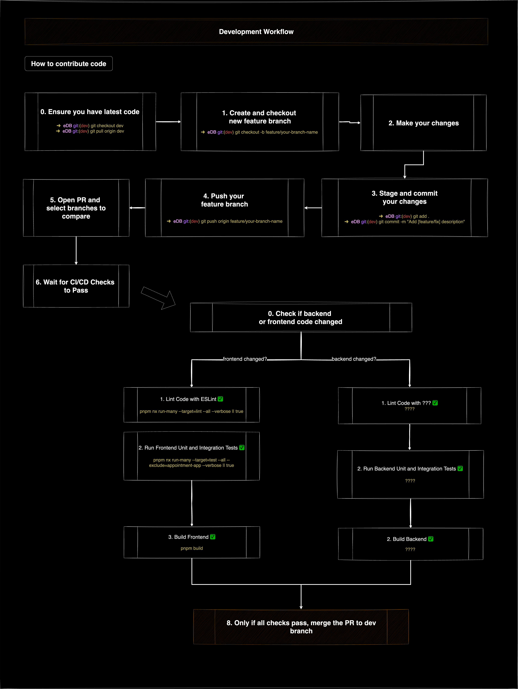

# eDB

## Table of Contents

-   [1. Project Goal](#1-project-goal)
-   [2. Setup](#2-setup)
    -   [2.1 Frontend](#21-frontend)
        -   [2.1.1 Tools and Features](#211-tools-and-features)
        -   [2.1.2 Portal and Platform Pages](#212-portal-and-platform-pages)
        -   [2.1.3 Shared Libraries](#213-shared-libraries)
        -   [2.1.4 Architecture Diagrams](#214-architecture-diagrams)
    -   [2.2 Backend](#22-backend)
        -   [2.2.1 Tools and Features](#221-tools-and-features)
        -   [2.2.2 Controllers and Endpoints](#222-controllers-and-endpoints)
            -   [2.2.2.1 Admin Controller](#2221-admin-controller)
            -   [2.2.2.2 Applications Controller](#2222-applications-controller)
            -   [2.2.2.3 Authentication Controller](#2223-authentication-controller)
            -   [2.2.2.4 Profile Controller](#2224-profile-controller)
        -   [2.2.3 Architecture Diagram](#223-architecture-diagram)
    -   [2.3 Database](#23-database)
-   [3. Environments](#3-environments)
    -   [3.1 Development](#31-development)
        -   [3.1.1 Architecture Diagram](#311-architecture-diagram)
        -   [3.1.2 Spinning up a cluster locally](#312-spinning-up-a-cluster-locally)
            -   [Step 0: Prerequisites](#step-0-prerequisites)
            -   [Step 1: Create and start a k3d cluster](#step-1-create-and-start-a-k3d-cluster)
            -   [Step 2: Create Dockerfiles for Your Services](#step-2-create-dockerfiles-for-your-services)
            -   [Step 3: Create Kubernetes Manifests](#step-3-create-kubernetes-manifests)
            -   [Step 4: Configure Skaffold](#step-4-configure-skaffold)
            -   [Step 5: Run Skaffold for Local Development](#step-5-run-skaffold-for-local-development)
        -   [3.1.3 Development Workflow](#313-development-workflow)
    -   [3.2 Production](#32-production)
        -   [3.2.1 Architecture Diagram](#321-architecture-diagram)
        -   [3.2.2 CI/CD Pipeline](#322-cicd-pipeline)
        -   [3.2.3 CI/CD Flow](#323-cicd-flow)
-   [4. Handy Commands Cheat Sheet](#4-handy-commands-cheat-sheet)
    -   [4.1 General Commands](#41-general-commands)
    -   [4.2 Database Management Commands](#42-database-management-commands)
-   [5. Current Goals](#5-current-goals)
-   [6. Unresolved Questions](#6-unresolved-questions)

---

## 1. Project Goal

I am building a platform housing multiple applications where users can make an account and subscribe to the apps and launch them.

## 2. Setup

### 2.1 Frontend

### 2.1.1 Tools and Features

-   Framework: **Angular 19**
-   Monorepo workspace: **Nx**
-   Documenting components: **Storybook 8**
-   API Integration: **TanStack Query** to efficiently fetch and manage data from the backend REST API.
-   Role-Based Access Control (RBAC): User, Premium User, Admin with **JWT**
-   Application Modularity: **Lazy-loading** sub-applications and routes within the platform for improved performance and scalability.

### 2.1.2 Portal And Platform Pages

#### User Account:

-   Login and registration page.
-   Profile page for updates, account deletion, and preference management.

#### Admin Panel:

-   Admin page to manage users and potentially revoke their subscriptions.
-   Separate view more page for every user.

#### Catalog:

-   Catalog page to browse applications.

#### My eDB:

-   Dashboard to manage and launch subscribed applications.

### 2.1.3 Shared Libraries

**UI Library**: Built using **Carbon Design System**. Provides reusable components such as buttons, modals, and input fields to ensure consistent design across applications.

-   Current amount of components: 21

**Utils Library**: Contains shared utility functions, services, and helpers to promote DRY (Don't Repeat Yourself) principles.

-   Current shared utils:
    -   Form utils service
    -   Modal utils service
    -   Table utils service
    -   Auth Interceptor

### 2.1.4 Architecture Diagrams



### 2.2 Backend

### 2.2.1 Tools and Features

-   Frameworks: **.NET 7** with **Entity Framework**
-   Architecture: **REST API**
-   Role-Based Access Control (RBAC): User, Premium User, Admin with **JWT**

### 2.2.2 Controllers and Endpoints

### 2.2.2.1 Admin Controller

### **Admin Area**

-   **URL**: `GET /api/admin/area`
-   **Authorization**: Admin
-   **Description**: Check access to the admin area.
-   **Response**:
    ```json
    "Welcome, Admin!"
    ```

### **Get Users with Pagination, Sorting, and Search**

-   **URL**: `GET /api/admin/users`
-   **Authorization**: Admin
-   **Query Parameters**:
    -   `cursor` (optional): Cursor for pagination.
    -   `sort` (optional): Sorting parameter in the format `field,direction` (e.g., `id,asc`).
    -   `search` (optional): Search query.
-   **Description**: Fetch a paginated, sorted list of users with optional search.
-   **Response**:
    ```json
    {
        "data": [
            {
                "id": 1,
                "firstName": "John",
                "lastName": "Doe",
                "email": "john.doe@example.com"
            }
        ],
        "nextCursor": "next_cursor_value",
        "hasMore": true
    }
    ```

### **Get User by ID**

-   **URL**: `GET /api/admin/users/{userId}`
-   **Authorization**: Admin
-   **Description**: Fetch details of a user by their ID.
-   **Response**:
    ```json
    {
        "id": 1,
        "firstName": "John",
        "lastName": "Doe",
        "email": "john.doe@example.com"
    }
    ```

### **Delete User**

-   **URL**: `DELETE /api/admin/users/{userId}`
-   **Authorization**: Admin
-   **Description**: Delete a user by their ID.
-   **Response**:
    ```json
    {
        "Message": "User deleted successfully."
    }
    ```

### **Get Applications Overview**

-   **URL**: `GET /api/admin/applications-overview`
-   **Authorization**: Admin
-   **Description**: Fetch an overview of all applications, including subscription data.
-   **Response**:
    ```json
    [
        {
            "ApplicationId": 1,
            "ApplicationName": "App1",
            "SubscriberCount": 10,
            "SubscribedUsers": [
                {
                    "UserId": 1,
                    "UserName": "John Doe",
                    "UserEmail": "john.doe@example.com",
                    "SubscriptionDate": "2024-12-14T12:34:56Z"
                }
            ]
        }
    ]
    ```

### **Add Application**

-   **URL**: `POST /api/admin/applications/create`
-   **Authorization**: Admin
-   **Description**: Add a new application.
-   **Request Body**:
    ```json
    {
        "name": "App1",
        "description": "Description of App1",
        "iconUrl": "https://example.com/icon.png",
        "routePath": "/app1",
        "tags": ["tag1", "tag2"]
    }
    ```
-   **Response**:
    ```json
    {
        "id": 1,
        "name": "App1",
        "description": "Description of App1",
        "iconUrl": "https://example.com/icon.png",
        "routePath": "/app1",
        "tags": ["tag1", "tag2"]
    }
    ```

### **Update Application**

-   **URL**: `PUT /api/admin/applications/{applicationId}`
-   **Authorization**: Admin
-   **Description**: Update an application.
-   **Request Body**:
    ```json
    {
        "name": "Updated App Name",
        "description": "Updated description",
        "iconUrl": "https://example.com/updated-icon.png",
        "routePath": "/updated-app",
        "tags": ["updatedTag"]
    }
    ```
-   **Response**:
    ```json
    {
        "Message": "Application updated successfully."
    }
    ```

### **Revoke Subscription**

-   **URL**: `DELETE /api/admin/applications/{applicationId}/subscriptions/{userId}`
-   **Authorization**: Admin
-   **Description**: Revoke a user's subscription to an application.
-   **Response**:
    ```json
    {
        "Message": "Subscription revoked successfully."
    }
    ```

### **Delete Application**

-   **URL**: `DELETE /api/admin/applications/{applicationId}`
-   **Authorization**: Admin
-   **Description**: Delete an application by its ID.
-   **Response**:
    ```json
    {
        "Message": "Application deleted successfully."
    }
    ```

---

### 2.2.2.2 Applications Controller

### **Get Applications**

-   **URL**: `GET /api/applications`
-   **Description**: Fetch a list of all applications.
-   **Response**:
    ```json
    [
        {
            "id": 1,
            "name": "App1",
            "description": "Description of App1"
        }
    ]
    ```

### **Subscribe/Unsubscribe to Application**

-   **URL**: `POST /api/applications/subscribe`
-   **Description**: Subscribe or unsubscribe to an application based on current subscription status.
-   **Request Body**:
    ```json
    {
        "applicationId": 1
    }
    ```
-   **Response**:
    ```json
    {
        "message": "Subscribed successfully."
    }
    ```

### **Get User's Applications**

-   **URL**: `GET /api/applications/user`
-   **Description**: Fetch applications subscribed to by the authenticated user.
-   **Response**:
    ```json
    [
        {
            "id": 1,
            "name": "App1",
            "description": "Description of App1"
        }
    ]
    ```

---

### 2.2.2.3 Authentication Controller

### **Register**

-   **URL**: `POST /api/auth/register`
-   **Description**: Register a new user.
-   **Request Body**:
    ```json
    {
        "email": "john.doe@example.com",
        "password": "password123",
        "firstName": "John",
        "lastName": "Doe"
    }
    ```
-   **Response**:
    ```json
    {
        "message": "Registration successful."
    }
    ```

### **Login**

-   **URL**: `POST /api/auth/login`
-   **Description**: Authenticate a user and generate a JWT token.
-   **Request Body**:
    ```json
    {
        "email": "john.doe@example.com",
        "password": "password123"
    }
    ```
-   **Response**:
    ```json
    {
        "message": "Login successful.",
        "token": "jwt_token_here"
    }
    ```

---

### 2.2.2.4 Profile Controller

### **Get Profile Settings**

-   **URL**: `GET /api/profile/settings`
-   **Authorization**: User/Admin
-   **Description**: Fetch the profile settings of the authenticated user.
-   **Response**:
    ```json
    {
        "email": "john.doe@example.com",
        "firstName": "John",
        "lastName": "Doe"
    }
    ```

### **Update Profile**

-   **URL**: `PUT /api/profile/update`
-   **Authorization**: User/Admin
-   **Description**: Update profile settings for the authenticated user.
-   **Request Body**:
    ```json
    {
        "firstName": "John",
        "lastName": "Doe"
    }
    ```
-   **Response**:
    ```json
    {
        "message": "Profile updated successfully."
    }
    ```

### 2.2.3 Architecture Diagram



---

### 2.3 Database

**Database**: PostgreSQL

---

## 3. Environments

### 3.1 Development

I am using **k3d**, which wraps my **k3s** Kubernetes distribution inside **Docker** containers. **k3s** is a lightweight Kubernetes distribution that allows me to orchestrate containers for scalable application deployment. I use **Skaffold** to manage my Kubernetes manifests, build Docker images and deploy them to my local k3d cluster. Skaffold also pulls any configured images, such as **PostgreSQL** and **Adminer**, enabling a complete local development environment.

#### 3.1.1 Architecture Diagram



#### 3.1.2 Spinning up a cluster locally

##### Step 0: Prerequisites

If you want to run this project locally, make sure you have the following installed:

1. **Docker**:  
   Download and install Docker from [https://www.docker.com/products/docker-desktop](https://www.docker.com/products/docker-desktop).

2. **k3d**:  
   Install k3d, a lightweight wrapper for running k3s in Docker.  
   Installation guide: [https://k3d.io/#installation](https://k3d.io/#installation)

    For example, using `brew` on macOS:

    ```bash
    brew install k3d
    ```

3. **kubectl**:  
   Install `kubectl`, the Kubernetes CLI tool, to manage the cluster.  
   Installation guide: [https://kubernetes.io/docs/tasks/tools/](https://kubernetes.io/docs/tasks/tools/)

4. **Skaffold**:  
   Download and install Skaffold for managing Kubernetes manifests and local development.  
   Installation guide: [https://skaffold.dev/docs/install/](https://skaffold.dev/docs/install/)

    For example, using `brew` on macOS:

    ```bash
    brew install skaffold
    ```

##### Step 1: Create and start a k3d cluster

Create a new k3d cluster and specify ports to expose the services running inside the cluster. These ports will be accessible from your host machine.

**Command to create the cluster:**

```bash
k3d cluster create mycluster --port "3200:3200@loadbalancer" --port "9101:9101@loadbalancer"
```

**Command to start the cluster:**

```bash
k3d cluster start mycluster
```

##### Step 2: Create Dockerfiles for Your Services

Create a `Dockerfile` for each service (e.g., `frontend` and `backend`).

##### Step 3: Create Kubernetes Manifests

Create Kubernetes manifests for all resources required by your application. These should include:

-   **Deployments**: Define how your frontend and backend applications will run, including resource limits and replicas.
-   **Services**: Expose your applications as `ClusterIP` or `LoadBalancer` types.
-   **ConfigMaps**: Store environment variables and other configurations.
-   **Secrets**: Store sensitive data securely (e.g., database credentials).
-   **Persistent Volumes (PVs) and Persistent Volume Claims (PVCs)**: Handle storage for services like PostgreSQL.

Ensure your manifests include the necessary annotations to work with k3d's local LoadBalancer and any ingress controllers you may use.

##### Step 4: Configure Skaffold

Create a `skaffold.yaml` file to manage your local development setup. This file defines how Skaffold will build, push, and deploy your services. Like where your Dockerfiles or Kubernetes manifests are located.

##### Step 5: Run Skaffold for Local Development

Use **Skaffold** to build and deploy your services automatically:

**Command:**

```bash
skaffold dev
```

This command will:

-   Build Docker images using your `Dockerfiles`.
-   Apply your Kubernetes manifests to the cluster.
-   Monitor your source code for changes and redeploy the services when updates are detected.

Once deployed, your frontend will be available at `http://localhost:4200` and your backend at `http://localhost:9101`. You can access these services via a browser or tools like Postman.

#### 3.1.3 Development Workflow

When you are able to spin up the cluster and access the frontend and backend, you are ready to contribute if you wish. Below is a visual representation of this workflow. You basically create a branch, make changes, open a PR and wait for checks to pass. After checks pass you can then merge to dev branch.



### 3.2 Production

#### 3.2.1 Architecture Diagrams


#### 3.2.2 CI/CD Pipeline

This CI/CD pipeline is designed to automate the process of building, validating, and deploying applications to a **Hetzner CAX21 VPS** running a **k3s cluster**. It ensures seamless updates to the live environment by leveraging **GitHub Actions**. Whenever code is pushed to the `main` branch, the pipeline builds Docker images for the backend and frontend, validates Kubernetes manifests, and deploys updated services to the k3s cluster. The pipeline also includes steps to roll back in case of errors during deployment.

#### 3.2.3 CI/CD Flow

##### Trigger

-   The pipeline is triggered by a push to the `main` branch of the GitHub repository.

##### Preparation

-   Ensures that the job runs only for commits not made by the GitHub Actions bot.
-   Checks out the repository code with full commit history for accurate versioning.

##### Versioning

-   Automatically increments the application version using the total number of commits in the repository.
-   Sets a unique Docker image tag based on the computed version (e.g., `v1.0.<commit_count>-prod`).

##### Docker Setup

-   Configures **Docker Buildx** to build multi-platform Docker images (e.g., for ARM63).
-   Authenticates to Docker Hub using credentials stored as GitHub Secrets.

##### Build and Push Docker Images

-   Builds and pushes the Docker image for the backend service from the `api` directory.
-   Builds and pushes the Docker image for the frontend service from the `eDB` directory.

##### Kubernetes Configuration

-   Configures `kubectl` using the kubeconfig stored as a GitHub Secret to interact with the k3s cluster.
-   Validates access to the Kubernetes cluster by displaying cluster information.

##### Linting

-   Lints the Kubernetes YAML manifests for both the backend and frontend services to ensure they are properly formatted.

##### Update Kubernetes Manifests

-   Replaces placeholders in the Kubernetes deployment YAML files with the new Docker image tag to deploy the latest version of the services.

##### Validation

-   Performs a dry-run validation of the updated YAML files to ensure they are correct and will apply successfully to the cluster.

##### Deployment

-   Deploys the updated Kubernetes manifests to the k3s cluster using `kubectl apply`.
-   Monitors the rollout status of each deployment to ensure it succeeds.
-   Automatically rolls back the deployment if there are issues during the rollout.

##### Commit Updated Manifests

-   Commits the updated Kubernetes manifests with the new image tags back to the GitHub repository for record-keeping.

##### Push Changes

-   Pushes the committed changes to the `main` branch of the repository.

---

## 4. Handy Commands Cheat Sheet

### 4.1 General Commands

| Command                                                          | Description                                  |
| ---------------------------------------------------------------- | -------------------------------------------- |
| `kubectl get services`                                           | List all services in the cluster             |
| `kubectl get pods`                                               | List all running pods                        |
| `kubectl describe pod <pod-name>`                                | Get detailed information on a specific pod   |
| `kubectl logs <pod-name>`                                        | View logs for a specific pod                 |
| `kubectl port-forward svc/<service> <local-port>:<service-port>` | Forward a port for local access to a service |
| `kubectl delete pod <pod-name>`                                  | Delete a specific pod (it will be restarted) |
| `kubectl apply -f <filename>.yaml`                               | Apply a YAML configuration to the cluster    |
| `kubectl delete -f <filename>.yaml`                              | Delete resources defined in a YAML file      |
| `k3d cluster create <name>`                                      | Create a new K3s cluster                     |
| `k3d cluster delete <name>`                                      | Delete an existing K3s cluster               |
| `skaffold dev`                                                   | Start Skaffold in development mode           |
| `skaffold run`                                                   | Deploy the application to the cluster        |
| `skaffold delete`                                                | Remove all Skaffold-managed resources        |

### 4.2 Database Management Commands

| Command                                                 | Description                                                           |
| ------------------------------------------------------- | --------------------------------------------------------------------- |
| `kubectl port-forward svc/<postgres-service> 5432:5432` | Forward PostgreSQL service to localhost for local access              |
| `psql -h localhost -p 5432 -U <username> -d <database>` | Connect to PostgreSQL database locally                                |
| `CREATE DATABASE <database>;`                           | Create a new database inside PostgreSQL                               |
| `\l`                                                    | List all databases                                                    |
| `\c <database>`                                         | Switch to a specific database                                         |
| `\dt`                                                   | List all tables in the current database                               |
| `kubectl get pods -n <namespace>`                       | Check if the database pod is running                                  |
| `kubectl logs <pod-name> -n <namespace>`                | View logs for the database pod to troubleshoot issues                 |
| `dotnet ef migrations add <MigrationName>`              | Create a new migration to modify the database schema                  |
| `dotnet ef database update`                             | Apply migrations to update the database schema                        |
| `kubectl delete pod <postgres-pod-name> -n <namespace>` | Restart the PostgreSQL pod if it’s stuck or needs to be reinitialized |
| `SELECT pg_terminate_backend(pg_stat_activity.pid)`     | Terminate connections to a specific database (see below for full SQL) |

---

## 5. Achieved Goals

-   [x] Setup development environment
-   [x] Setup production environment
-   [x] Diagrams for CI/CD, Dockerfiles, production and dev setup, frontend and backend architecture
-   [x] Documentation
-   [x] Refactor CI/CD pipeline into prod and dev workflows
-   [x] Linting, unit testing, build checks in pipeline before merge to dev branch.

## 5. Current Goals

### Documentation

-   [ ] Streamline README documentation
-   [ ] Look into Swagger

### Frontend

-   [ ] Add graphs to the admin page
-   [ ] Make UI look nicer and responsive

### Backend

-   [ ] Refactor backend (use AutoMapper, improve code quality, add missing DTOs for Application Controller)

### Devops & Testing

-   [ ] Test CI/CD pipeline production
-   [ ] Add integration, E2E testing, and unit testing for backend to the pipeline

### 6. Unresolved Questions

-   [ ] Best practices for Observables and Signals
-   [ ] Overall Frontend architecture
-   [ ] [Violation] warnings in console
-   [ ] Feedback on clarity of documentation and diagrams
-   [ ] Nx Cloud?
-   [ ] Staging environment?
-   [ ] Database backups?
-   [ ] SOLID principles?
-   [ ] Argo CD?
-   [ ] Redis caching integration?
