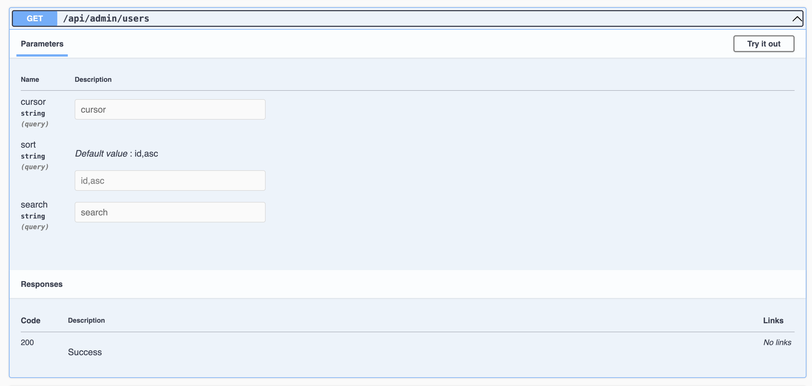

# eDB

## Documentation

-   [1. Project Goal](#1-project-goal)
-   [2. Nx Setup](#2-nx-setup)
    -   [2.1 Frontend](#21-frontend)
        -   [2.1.1 Stack & Architecture](#211-stack--architecture)
        -   [2.1.2 Application Pages](#212-application-pages)
            -   [Web App](#web-app)
            -   [Admin App](#admin-app)
        -   [2.1.3 Layers of Modular Architecture](#213-layers-of-modular-architecture)
        -   [2.1.4 Architecture Diagrams](#214-architecture-diagrams)
    -   [2.2 Backend](#22-backend)
        -   [2.2.1 Stack & Architecture](#221-stack--architecture)
        -   [2.2.2 APIs](#222-apis)
            -   [Platform API](#platform-api)
            -   [Admin API](#admin-api)
        -   [2.2.3 Architecture Diagrams](#223-architecture-diagrams)
-   [3. Environments](#3-environments)
    -   [3.1 Development](#31-development)
        -   [3.1.1 Setup](#311-setup)
            -   [Local k3s Cluster (k3d + Skaffold)](#local-k3s-cluster-k3d--skaffold)
            -   [[NEW] Nx Development Setup](#new-nx-development-setup)
        -   [3.1.2 Tools](#312-tools)
            -   [Swagger](#swagger)
            -   [Postman](#postman)
            -   [xUnit](#xunit)
            -   [Storybook](#storybook)
            -   [Vitest](#vitest)
            -   [Prettier](#prettier)
            -   [ESLint](#eslint)
    -   [3.2 Staging & Production](#32-staging--production)
        -   [3.2.1 Dockerfiles](#321-dockerfiles)
        -   [3.2.2 Architecture Diagram](#322-architecture-diagram)
-   [4. CI/CD](#4-cicd)
-   [5. Database](#5-database)
-   [6. VPS](#6-vps)
    -   [6.1 What is a VPS?](#61-what-is-a-vps)
    -   [6.2 Setting up a VPS with Hetzner](#62-setting-up-a-vps-with-hetzner)
-   [7. Project Management and Documentation](#7-project-management-and-documentation)
    -   [7.1 Jira](#71-jira)
    -   [7.2 Tags and releases](#72-tags-and-releases)
    -   [7.3 Confluence](#73-confluence)
-   [8. Handy Commands Cheat Sheet](#8-handy-commands-cheat-sheet)
    -   [8.1 General Commands](#81-general-commands)
    -   [8.2 Database Management Commands](#82-database-management-commands)
-   [9. Achieved Goals](#9-achieved-goals)
-   [10. TLDR: All Tools Used](#10-tldr-all-tools-used)
-   [11. Tools I'm working towards using](#11-tools-im-working-towards-using)

---

## 1. Project Goal

I am building a platform housing multiple applications. Users can make an account, subscribe to the apps and launch them.

## 2. Nx Setup

This project uses Nx to efficiently manage multiple applications and shared libraries within a monorepo structure. Nx provides several key advantages:

### 🚀 **Why Use Nx?**

1. **Modular Architecture** – Nx helps divide the project into separate **apps** and **reusable libraries**, promoting maintainability and scalability.
2. **Efficient CI/CD** – With `nx affected`, only the changed parts of the codebase are rebuilt and tested, making the CI process **faster and more efficient**.
3. **Code Sharing** – Shared libraries eliminate code duplication by allowing different applications to **reuse UI components, utilities, and services**.
4. **Better Developer Experience** – Nx provides **powerful CLI tools**, **caching**, and **dependency graph visualization**, making development more streamlined.
5. **Optimized Builds** – Nx uses smart caching and incremental builds, ensuring that only necessary files are compiled, reducing build times.
6. **Consistent Tooling** – It enforces best practices by integrating with Angular, React, TypeScript, Jest, ESLint, Storybook, and other tools seamlessly.

By leveraging Nx, this monorepo allows for a more structured, scalable, and optimized development workflow, making it easier to maintain and extend over time.

Initially I used this only for the frontend. Using the `@nx-dotnet/core` package I was able to get my frontend and backend code together in this one codebase.

### 2.1 Frontend

### 2.1.1 Stack & Architecture

#### Stack

-   **Framework**: **Angular 19**
-   **Component Documentation**: **Storybook 8**
-   **Unit Testing**: **Vitest** for fast and reliable unit testing.
-   **Linting**: **ESLint** to enforce consistent code quality and best practices.
-   **Code Formatting**: **Prettier** for automatic code formatting and style consistency.
-   **API Integration**: **TanStack Query** for efficient data fetching and state management with the backend REST API.
-   **Role-Based Access Control (RBAC)**: User, Premium User, Admin with **JWT authentication**.

#### Architecture

The application follows a **Layered Modular Architecture** in Nx, designed for flexibility and maintainability. Each layer has a distinct role, enforcing strict dependency rules to keep the system modular.

### 2.1.2 Application Pages

#### Web App:

-   **User Account**:

    -   [Login page](https://app.eliasdebock.com/login)
    -   [Registration page](https://app.eliasdebock.com/register)
    -   [Profile page](https://app.eliasdebock.com/profile) for updates, account deletion, and preference management

-   [**Catalog**](https://app.eliasdebock.com/catalog):

    -   Browse available applications

-   [**My eDB**](https://app.eliasdebock.com/dashboard):

    -   Dashboard to manage and launch subscribed applications

-   [**404**](https://app.eliasdebock.com/not-found):

    -   For routes that are not found

#### Admin App:

-   [**User Management**](https://app.eliasdebock.com/admin):

    -   [Admin dashboard](https://app.eliasdebock.com/admin/dashboard) to manage users and their subscriptions.
    -   Dedicated view page for each user.

-   [**Subscription Control**](https://app.eliasdebock.com/admin/dashboard):

    -   Ability to revoke or modify user subscriptions.

### 2.1.3 Layers of Modular Architecture

##### 1. Application Layer (Apps) 🏛

-   Contains **root-level orchestration** (e.g., routing).
-   Does **not** contain feature logic but instead delegates to feature modules.
-   Directly interacts only with the **Feature Layer**.

##### 2. Feature Layer (Feature Libs) 📦

-   Implements **business logic** for different pages (e.g., Dashboard, Profile, Appointments).
-   Depends on **UI components** for presentation and **Data-Access** for API communication.
-   Features are **structured as pages**, ensuring modularity within the platform.

##### 3. UI/Presentation Layer (UI Libs) 🎨

-   Houses **reusable UI components** shared across pages.
-   Focuses purely on **presentation**, without business or data-fetching logic.
-   Built with **Storybook 8** for documentation and design consistency.
-   Built using **Carbon Design System**.

##### 4. Data-Access Layer (Client Libs) 🔄

-   Handles **API communication, caching, and state management** using **TanStack Query**.
-   Provides an abstraction over direct API calls, making feature modules independent of API changes.
-   Ensures a **clean separation** between UI and backend interactions.

##### 5. Utility & Shared Layer (Utils, Shared-Env, etc.) 🔧

-   Contains **cross-cutting utilities**, such as environment configurations, constants, and helper functions.
-   Keeps global concerns separate from features, ensuring **clean code structure**.

##### Why This Structure? 🚀

This **modular and scalable structure** ensures:

-   **Decoupling of concerns**, improving maintainability and testability.
-   **Optimized builds**, as changes in one layer do not trigger unnecessary rebuilds.
-   **Easier feature expansion**, allowing new pages to be added without affecting existing ones.

By following **Layered Modular Architecture**, the system remains **scalable, testable, and maintainable** over time. That is the goal at least...

### 2.1.4 Architecture Diagrams

**V1: Monolithic Platform App**
The first model of the platform using a familiar monolithic approach.


**V2: Layered Modular Platform App and Admin App**
This is a visual representation of the workspace dependency graph concerning the frontend as is right now. This is a more layered modular approach. I split up my pages and services into reusable and independently testable libraries. This refactor tries to follow best practices for Nx Workspaces. To learn more check out their [documentation](https://nx.dev/concepts/decisions). Tried to abstract these libraries into layers in my mental model of this trying to learn more about architecture.


> **Tip:** Run `nx graph` to see the full dependency graph. Which looks like this:


### 2.2 Backend

### 2.2.1 Stack & Architecture

-   **Frameworks**: **.NET 8**
-   **ORM**: **Entity Framework**
-   **Object Mapper**: **Automapper** is a library for .NET that automatically maps data between objects, eliminating the need for manual property assignments.
-   **Role-Based Access Control (RBAC)**: User, Premium User, Admin with **JWT authentication**
-   **Testing**: **xUnit** and **Moq** for unit and integration testing
-   **Architecture**: **REST API**

### 2.2.2 APIs

#### **Platform API**

The **Platform API** serves as the backbone for all core functionalities, providing endpoints for application management, user subscriptions, and authentication.

##### **Endpoints**

###### **Applications**

-   **Get Applications**

    -   **URL**: `GET /api/applications`
    -   **Description**: Fetch a list of all applications.
    -   **Response:**
        ```json
        [
            {
                "id": 1,
                "name": "App1",
                "description": "Description of App1"
            }
        ]
        ```

-   **Subscribe/Unsubscribe to Application**

    -   **URL**: `POST /api/applications/subscribe`
    -   **Description**: Subscribe or unsubscribe to an application based on current subscription status.
    -   **Request Body:**
        ```json
        {
            "applicationId": 1
        }
        ```
    -   **Response:**
        ```json
        {
            "message": "Subscribed successfully."
        }
        ```

-   **Get User's Applications**
    -   **URL**: `GET /api/applications/user`
    -   **Description**: Fetch applications subscribed to by the authenticated user.
    -   **Response:**
        ```json
        [
            {
                "id": 1,
                "name": "App1",
                "description": "Description of App1"
            }
        ]
        ```

###### **Authentication**

-   **Register**

    -   **URL**: `POST /api/auth/register`
    -   **Description**: Register a new user.
    -   **Request Body:**
        ```json
        {
            "email": "john.doe@example.com",
            "password": "password123",
            "firstName": "John",
            "lastName": "Doe"
        }
        ```
    -   **Response:**
        ```json
        {
            "message": "Registration successful."
        }
        ```

-   **Login**
    -   **URL**: `POST /api/auth/login`
    -   **Description**: Authenticate a user and generate a JWT token.
    -   **Request Body:**
        ```json
        {
            "email": "john.doe@example.com",
            "password": "password123"
        }
        ```
    -   **Response:**
        ```json
        {
            "message": "Login successful.",
            "token": "jwt_token_here"
        }
        ```

###### **Profile**

-   **Get Profile Settings**

    -   **URL**: `GET /api/profile/settings`
    -   **Authorization**: User/Admin
    -   **Description**: Fetch the profile settings of the authenticated user.
    -   **Response:**
        ```json
        {
            "email": "john.doe@example.com",
            "firstName": "John",
            "lastName": "Doe"
        }
        ```

-   **Update Profile**
    -   **URL**: `PUT /api/profile`
    -   **Authorization**: User/Admin
    -   **Description**: Update profile settings for the authenticated user.
    -   **Request Body:**
        ```json
        {
            "firstName": "John",
            "lastName": "Doe"
        }
        ```
    -   **Response:**
        ```json
        {
            "message": "Profile updated successfully."
        }
        ```

#### **Admin API**

The **Admin API** handles administrative tasks, including user management, application CRUD operations, and subscription management.

##### **Endpoints**

###### **Admin Management**

-   **Admin Area**
    -   **URL**: `GET /api/admin/area`
    -   **Authorization**: Admin
    -   **Description**: Check access to the admin area.
    -   **Response:**
        ```json
        "Welcome, Admin!"
        ```

###### **User Management**

-   **Get Users with Pagination, Sorting, and Search**

    -   **URL**: `GET /api/admin/users`
    -   **Authorization**: Admin
    -   **Query Parameters:**
        -   `cursor` (optional): Cursor for pagination.
        -   `sort` (optional): Sorting parameter in the format `field,direction`.
        -   `search` (optional): Search query.
    -   **Description**: Fetch a paginated, sorted list of users with optional search.
    -   **Response:**
        ```json
        {
            "data": [
                {
                    "id": 1,
                    "firstName": "John",
                    "lastName": "Doe",
                    "email": "john.doe@example.com"
                }
            ],
            "nextCursor": "next_cursor_value",
            "hasMore": true
        }
        ```

-   **Get User by ID**

    -   **URL**: `GET /api/admin/users/{userId}`
    -   **Authorization**: Admin
    -   **Description**: Fetch details of a user by their ID.
    -   **Response:**
        ```json
        {
            "id": 1,
            "firstName": "John",
            "lastName": "Doe",
            "email": "john.doe@example.com"
        }
        ```

-   **Delete User**
    -   **URL**: `DELETE /api/admin/users/{userId}`
    -   **Authorization**: Admin
    -   **Description**: Delete a user by their ID.
    -   **Response:**
        ```json
        {
            "Message": "User deleted successfully."
        }
        ```

###### **Application Management**

-   **Get Applications Overview**

    -   **URL**: `GET /api/admin/applications`
    -   **Authorization**: Admin
    -   **Description**: Fetch an overview of all applications, including subscription data.
    -   **Response:**
        ```json
        [
            {
                "ApplicationId": 1,
                "ApplicationName": "App1",
                "SubscriberCount": 10,
                "SubscribedUsers": [
                    {
                        "UserId": 1,
                        "UserName": "John Doe",
                        "UserEmail": "john.doe@example.com",
                        "SubscriptionDate": "2024-12-14T12:34:56Z"
                    }
                ]
            }
        ]
        ```

-   **Add Application**

    -   **URL**: `POST /api/admin/applications`
    -   **Authorization**: Admin
    -   **Description**: Add a new application.
    -   **Request Body:**
        ```json
        {
            "name": "App1",
            "description": "Description of App1",
            "iconUrl": "https://example.com/icon.png",
            "routePath": "/app1",
            "tags": ["tag1", "tag2"]
        }
        ```
    -   **Response:**
        ```json
        {
            "id": 1,
            "name": "App1",
            "description": "Description of App1",
            "iconUrl": "https://example.com/icon.png",
            "routePath": "/app1",
            "tags": ["tag1", "tag2"]
        }
        ```

-   **Update Application**

    -   **URL**: `PUT /api/admin/applications/{applicationId}`
    -   **Authorization**: Admin
    -   **Description**: Update an application.
    -   **Request Body:**
        ```json
        {
            "name": "Updated App Name",
            "description": "Updated description",
            "iconUrl": "https://example.com/updated-icon.png",
            "routePath": "/updated-app",
            "tags": ["updatedTag"]
        }
        ```
    -   **Response:**
        ```json
        {
            "Message": "Application updated successfully."
        }
        ```

-   **Revoke Subscription**

    -   **URL**: `DELETE /api/admin/applications/{applicationId}/subscriptions/{userId}`
    -   **Authorization**: Admin
    -   **Description**: Revoke a user's subscription to an application.
    -   **Response:**
        ```json
        {
            "Message": "Subscription revoked successfully."
        }
        ```

-   **Delete Application**
    -   **URL**: `DELETE /api/admin/applications/{applicationId}`
    -   **Authorization**: Admin
    -   **Description**: Delete an application by its ID.
    -   **Response:**
        ```json
        {
            "Message": "Application deleted successfully."
        }
        ```

### 2.2.3 Architecture Diagrams

**V1: Monolithic Platform API**
The first model of the platform using a familiar monolithic approach.


**V2: Layered Modular Platform API and Admin API**
This is a visual representation of the workspace dependency graph regarding backend as is right now. This is a more layered modular approach. Refactored Controllers and Services into feature-libs, abstracted the Repositories and DbContext also into its own layer... Basically tried to also think more in terms of layers that depend on each other and get some structure going here too. Also took the first step towards separate Platform and Admin API.


---

## 3. Environments

### 3.1 Development

#### 3.1.1 Setup

##### **Local k3s Cluster (k3d + Skaffold)**

> **Note:** This is the first setup I ever created for development on my local machine

The project is using **k3d**, which wraps my **k3s** Kubernetes distribution inside **Docker** containers. **k3s** is a lightweight Kubernetes distribution that allows me to orchestrate containers for scalable application deployment. I use **Skaffold** to manage my Kubernetes manifests, build Docker images and deploy them to my local k3d cluster. Skaffold also pulls any configured images, such as **PostgreSQL** and **Adminer**, enabling a complete local development environment.

**Spinning up a cluster locally**

##### Step 0: Prerequisites

If you want to run this project locally, make sure you have the following installed:

1. **Docker**:  
   Download and install Docker from [https://www.docker.com/products/docker-desktop](https://www.docker.com/products/docker-desktop).

2. **k3d**:  
   Install k3d, a lightweight wrapper for running k3s in Docker.  
   Installation guide: [https://k3d.io/#installation](https://k3d.io/#installation)

    For example, using `brew` on macOS:

    ```bash
    brew install k3d
    ```

3. **kubectl**:  
   Install `kubectl`, the Kubernetes CLI tool, to manage the cluster.  
   Installation guide: [https://kubernetes.io/docs/tasks/tools/](https://kubernetes.io/docs/tasks/tools/)

4. **Skaffold**:  
   Download and install Skaffold for managing Kubernetes manifests and local development.  
   Installation guide: [https://skaffold.dev/docs/install/](https://skaffold.dev/docs/install/)

    For example, using `brew` on macOS:

    ```bash
    brew install skaffold
    ```

##### Step 1: Create and start a k3d cluster

Create a new k3d cluster and specify ports to expose the services running inside the cluster. These ports will be accessible from your host machine.

**Command to create the cluster:**

```bash
k3d cluster create mycluster --port "3200:3200@loadbalancer" --port "9101:9101@loadbalancer"
```

**Command to start the cluster:**

```bash
k3d cluster start mycluster
```

##### Step 2: Create Dockerfiles for Your Services

Create a `Dockerfile` for each service (e.g., `frontend` and `backend`).

##### Step 3: Create Kubernetes Manifests

Create Kubernetes manifests for all resources required by your application. These should include:

-   **Deployments**: Define how your frontend and backend applications will run, including resource limits and replicas.
-   **Services**: Expose your applications as `ClusterIP` or `LoadBalancer` types.
-   **ConfigMaps**: Store environment variables and other configurations.
-   **Secrets**: Store sensitive data securely (e.g., database credentials).
-   **Persistent Volumes (PVs) and Persistent Volume Claims (PVCs)**: Handle storage for services like PostgreSQL.

Ensure your manifests include the necessary annotations to work with k3d's local LoadBalancer and any ingress controllers you may use.

##### Step 4: Configure Skaffold

Create a `skaffold.yaml` file to manage your local development setup. This file defines how Skaffold will build, push, and deploy your services. Like where your Dockerfiles or Kubernetes manifests are located.

##### Step 5: Run Skaffold for Local Development

Use **Skaffold** to build and deploy your services automatically:

**Command:**

```bash
skaffold dev
```

This command will:

-   Build Docker images using your `Dockerfiles`.
-   Apply your Kubernetes manifests to the cluster.
-   Monitor your source code for changes and redeploy the services when updates are detected.

Once deployed, your frontend will be available at `http://localhost:4200` and your backend at `http://localhost:9101`. You can access these services via a browser or tools like Postman.

Here is a diagram of the setup:


##### **[NEW] Nx development setup**

However I did not like rebuilding images all the time and even though it went smooth to set up staging and production because I had a pretty similar setup on my own machine. I simplified the dev setup after refactoring my backend to be included in the Nx workspace.

```
  "scripts": {
    "start:web": "nx serve eDB --host 0.0.0.0",
    "start:admin": "nx serve eDB-admin --host 0.0.0.0 --port 4300",
    "start:platform-api": "nx serve platform-api",
  },
```

Running these scripts with pnpm (e.g. `pnpm start:web`) will start up either the platform app, the admin app or the platform-api. Can be extended with more as the platform grows. You will have to setup a local db which is easily done through your terminal and through the Postgres App.

#### 3.1.2 Tools

These are some of the tools I use when developing locally:

##### Swagger

You can find the Swagger API docs at: `http://localhost:5098/swagger/index.html`. Which gives you a nice overview of all endpoints, models and DTOs. You can also try out the endpoints here.




##### Postman

I use Postman to test my endpoints in isolation. [Installation link](https://www.postman.com/downloads).


##### XUnit and Moq

I use XUnit and Moq to do unit and integration testing.


##### Storybook

You can find the Storybook overview by running: `nx storybook ui`. You will get a nice overview of all components at `http://localhost:4400/`.


##### Vitest

I use Vitest to do unit and integration testing in frontend.


##### Prettier

I use Prettier to test my endpoints in isolation.

##### ESLint

I use ESLint to test my endpoints in isolation.

### 3.2 Staging & Production

#### 3.2.1 Dockerfiles

These are the Dockerfiles used in production for my frontend and backend apps. The frontend Docker images just serve the built files provided by the pipeline. The backend still has a multi-stage Dockerfile building the application and running the server. Even though Nx takes care of building in the pipeline already. I will have to see later what to do about this. Staging has a similar setup.


#### 3.2.2 Architecture Diagram

This is my current production cluster. When the pipeline runs to deploy it's actually updating these deployments here with a brand new Docker image or it rolls back if that does not go as planned. To configure different domains, I had to add an A record to my settings at Cloudflare that point to the public IPv4 address of my VPS.


## 4. CI/CD

To smoothly update my staging and production environments, I have built several pipelines. This is how it goes:

**Creating a branch**
Checkout dev branch and pull latest code. Create a feature-branch locally, make changes and open a PR to compare your branch to the dev branch.

**Opening a PR: pre-merge checks**
When you open the PR, a pre-merge pipeline will attempt to lint, test and build only the affected code. It will also push Docker images to Docker Hub. When these checks pass, you can then safely merge to dev branch to automatically start deployment to staging.


**Deploying to staging: post-merge deployment**
After all checks pass and you have merged successfully, a pipeline will run deploying the build to a staging environment that mimics production.

**URLs**:

-   https://app.staging.eliasdebock.com
-   https://app.staging.eliasdebock.com/admin
-   https://api.staging.eliasdebock.com

**Opening a second PR: pre-merge checks**

After you merged to the dev branch, you can proceed to make another PR. This time to push to production, to merge with the main branch. A pre-merge pipeline will running the same linting, testing and building process as the pre-merge checks for staging. After those pass you can merge to main branch.

**Deploying to production: post-merge deployment**

You can then click the button to merge to main branch. This will trigger the final pipeline to deploy to production.

**URLs**:

-   https://app.eliasdebock.com
-   https://app.eliasdebock.com/admin
-   https://api.eliasdebock.com

Below is a visual representation of all the pipelines running in the project.


You can also see this run live on GitHub, under the Actions tab:


---

## 5. Database

**Database**: PostgreSQL

---

## 6. VPS

### 6.1 What is a VPS?

A **Virtual Private Server (VPS)** is a virtualized environment that provides dedicated resources on a shared physical server. It offers a balance between cost, performance, and control, making it a popular choice for hosting applications and services.

#### Key Features of a VPS

-   **Dedicated Resources**: Allocated CPU, RAM, and storage that are exclusive to your VPS.
-   **Root Access**: Full control over the server to customize it as needed.
-   **Performance Isolation**: Other users on the same physical server do not impact your performance.
-   **Scalability**: Easily upgrade or downgrade resources based on your needs.
-   **Cost-Effective**: More affordable than a dedicated server, with similar customization and isolation benefits.

> **Note:** While the physical hardware is shared, the virtualization layer ensures resource isolation and predictable performance.

#### 6.2 Setting up a VPS with Hetzner

#### Step 0: Setting up your account

-   Create an account on [Hetzner](https://accounts.hetzner.com/signUp).

-   Navigate to your [account section](https://console.hetzner.cloud/projects).

#### Step 1: Configure server on Hetzner

Under the 'Servers' tab you should find a button to add a server to your account. Let's go over the easy steps first needed to configure our server. It's pretty straight forward.


You will need to set

-   #### Location

    Location of server.
    

-   #### Image OS:

    This project runs on Ubuntu.
    

-   #### Type:

    I'm on shared ARM64 vCPUs.
    

-   #### Networking:

    

#### Step 2: Generating an SSH key


Run following command on your machine:

`ssh-keygen -t rsa -b 4096 -C "your_email@example.com" -f /path/to/your/custom_key_name`

-   **-t rsa**: Specifies the type of key (RSA).
-   **-b 4096**: Sets the key size to 4096 bits for better security.
-   **-C "your_email@example.com"**: Adds a comment, typically your email address.
-   **-f /path/to/your/custom_key_name**: Specifies the file path and name for the key.

You can add an optional passphrase. Skip or add one for more security.

#### Step 3: Retrieving the public key

After generating the key, the private key will be at /path/to/your/custom_key, and the public key will be at /path/to/your/custom_key.pub.

To retrieve the public key:
`cat /path/to/your/custom_key.pub`
Copy the output to use in your cloud-config or in the setup of the server as seen below here.


#### Step 4: Volumes

You can add volumes to store data. This is needed if you want the data of your database to be persistent.

#### Step 5: Cloud config and server name

Cloud-init is a powerful tool used for automating the initial setup and configuration of cloud servers during their first boot.
[This article](https://community.hetzner.com/tutorials/basic-cloud-config) takes you step by step in the setup of a cloud-init script. The script will handle users set up, SSH keys and permissions, install packages, run custom scripts, configure firewalls or securing SSH.

## 7. Project Management and Documentation

### 7.1 Jira

Jira is used as a central tool to organize, track, and manage work. It supports various issue types for different kinds of work items, helps structure tasks under epics, and facilitates agile sprint planning and execution.

---

#### Issue types

Jira provides different issue types to categorize work, each serving a unique purpose. Understanding these types helps in organizing and managing issues effectively:

**Epics:**

-   **Purpose:** Large bodies of work that can be broken down into smaller tasks (stories, tasks, spikes).
-   **Usage:** In this project, four main epics categorize all work:
    -   **Project Management:** Organizing work, planning sprints, refining backlog items, and improving management processes.
    -   **Frontend:** Focusing on user interface, user experience, data visualization, responsiveness, testing, and code quality improvements.
    -   **Backend:** Pertaining to API development, code refactoring, testing, architectural decisions, and infrastructure improvements.
    -   **DevOps:** Covering CI/CD pipelines, server management, security, infrastructure automation, and related research (spikes) for deployment tools and strategies.

**Stories:**

-   **Purpose:** Represent user-centric features or requirements from an end-user’s perspective.
-   **Usage:** Capture specific functionalities or enhancements that deliver value to users. For example: “As an admin, I want to see graphs on the dashboard so that I can analyze data trends easily.”

**Tasks:**

-   **Purpose:** Represent technical or operational work that doesn’t directly translate into a user feature but is necessary for project progress.
-   **Usage:** Used for maintenance, setup, refactoring, and other work items like “Setup My First Sprint” or “Refactor Goals and Unresolved Questions into Jira Tickets.”

**Spikes:**

-   **Purpose:** Time-boxed research or investigation tasks to explore solutions, reduce uncertainty, or gather information.
-   **Usage:** Used for exploring best practices, evaluating new tools, or researching architectural approaches. Spikes are labeled as such for easy identification.

---

#### Setting up a sprint


**1. Prepare your backlog:**  
Ensure that your backlog is prioritized and contains refined stories, tasks, and spikes linked to their respective epics.

**2. Create a new sprint:**  
Navigate to the **Backlog** view on your Scrum board and click on **“Create sprint”** at the top of the backlog. A new sprint container will appear, ready to be populated with issues.

**3. Select issues for the sprint:**  
Drag and drop high-priority issues from the backlog into the new sprint container. Choose issues that align with the sprint goal and team capacity, maintaining a balance of feature development, technical tasks, and research activities.

**4. Define sprint goals and timeline:**  
Optionally, edit the sprint details to set a clear sprint goal that describes what you aim to achieve. Set start and end dates, and determine the sprint duration.

**5. Start the sprint:**  
Once the sprint is populated and goals are defined, click **“Start sprint”**. Jira automatically creates a Scrum board for the sprint if one isn’t already configured. This board visualizes the sprint backlog, in-progress tasks, and completed work.

---

#### Working with the Jira Board

-   **Automatic board creation:**  
    When a sprint is started, Jira generates a Scrum board that reflects the sprint’s issues. The board typically includes columns (e.g., To Do, In Progress, Done) that represent the workflow stages.

-   **Using the board:**

    -   **Visualize progress:** Team members can drag issues across columns as work progresses.
    -   **Daily standups:** Use the board during standups to discuss what’s in progress, what’s completed, and identify blockers.
    -   **Update issues:** Team members update issue statuses, log work, and add comments directly on the board to keep everyone informed.

-   **Completing the Sprint:**  
    At the end of the sprint, review completed work on the board. Use Jira’s **“Complete sprint”** feature to close the sprint, move unfinished tasks back to the backlog or the next sprint, and plan for future sprints.

### 7.2 Tags and releases

At the end of each sprint, there will be a new version to be settled upon. This will become the new tag made in the pipeline to tag the Docker image and also will be used in the release notes to publish a release on GitHub from.

Here is an [overview](https://github.com/Eliasdb/eDB/releases) of all releases so far.

### 7.3 Confluence

I intend to migrate this README to Confluence pages. More on this at a later time.
URL to [Confluence space](https://metanoi4.atlassian.net/wiki/spaces/eDB/overview). Only visible if you are part of the team.

## 8. Handy Commands Cheat Sheet

### 5.1 General Commands

| Command                                                          | Description                                  |
| ---------------------------------------------------------------- | -------------------------------------------- |
| `kubectl get services`                                           | List all services in the cluster             |
| `kubectl get pods`                                               | List all running pods                        |
| `kubectl describe pod <pod-name>`                                | Get detailed information on a specific pod   |
| `kubectl logs <pod-name>`                                        | View logs for a specific pod                 |
| `kubectl port-forward svc/<service> <local-port>:<service-port>` | Forward a port for local access to a service |
| `kubectl delete pod <pod-name>`                                  | Delete a specific pod (it will be restarted) |
| `kubectl apply -f <filename>.yaml`                               | Apply a YAML configuration to the cluster    |
| `kubectl delete -f <filename>.yaml`                              | Delete resources defined in a YAML file      |
| `k3d cluster create <name>`                                      | Create a new K3s cluster                     |
| `k3d cluster delete <name>`                                      | Delete an existing K3s cluster               |
| `k3d cluster start <name>`                                       | Start an existing K3s cluster                |
| `skaffold dev`                                                   | Start Skaffold in development mode           |
| `skaffold run`                                                   | Deploy the application to the cluster        |
| `skaffold delete`                                                | Remove all Skaffold-managed resources        |

### 5.2 Database Management Commands

| Command                                                 | Description                                                           |
| ------------------------------------------------------- | --------------------------------------------------------------------- |
| `kubectl port-forward svc/<postgres-service> 5432:5432` | Forward PostgreSQL service to localhost for local access              |
| `psql -h localhost -p 5432 -U <username> -d <database>` | Connect to PostgreSQL database locally                                |
| `CREATE DATABASE <database>;`                           | Create a new database inside PostgreSQL                               |
| `\l`                                                    | List all databases                                                    |
| `\c <database>`                                         | Switch to a specific database                                         |
| `\dt`                                                   | List all tables in the current database                               |
| `kubectl get pods -n <namespace>`                       | Check if the database pod is running                                  |
| `kubectl logs <pod-name> -n <namespace>`                | View logs for the database pod to troubleshoot issues                 |
| `dotnet ef migrations add <MigrationName>`              | Create a new migration to modify the database schema                  |
| `dotnet ef database update`                             | Apply migrations to update the database schema                        |
| `kubectl delete pod <postgres-pod-name> -n <namespace>` | Restart the PostgreSQL pod if it’s stuck or needs to be reinitialized |
| `SELECT pg_terminate_backend(pg_stat_activity.pid)`     | Terminate connections to a specific database (see below for full SQL) |

---

## 9. Achieved Goals

-   [x] Containerizing applications (Dockerfiles)
-   [x] Development environment (k3s cluster using k3d managed with Skaffold OR Nx)
-   [x] Staging environment (k3s cluster on VPS)
-   [x] Production environment (k3s cluster on VPS)
-   [x] CI/CD pipelines for production and staging, with pre-merge checks and post-merge deployment (self-hosted ARM Github Actions runner on VPS).
-   [x] Documentation
-   [x] Layered Modular Architecture for Frontend and Backend

## 10. TLDR: All Tools Used

**DevOps**

-   [x] **Docker**: Docker Compose - Docker Desktop - Docker Hub - Dockerfiles - Docker images
-   [x] **Kubernetes**: k3d - k3s - kubectl - Ingress - deployments - services - pods - secrets - configmaps - YAML
-   [x] **Servers**: Linux - VPS - Static file web server (NGINX) - API web server (.NET Web API) - Database server (Postgres) - shell scripts (wait-for-postgres to ping database to start up API)
-   [x] **CI/CD**: Github Actions - GitFlow - `nx affected` - yamllint

**Monorepo**

-   [x] **Nx**: apps - libs - Nx Generators/Scaffolding commands - nx affected - modular layered architecture

**Frontend**

-   [x] **Language**: Typescript
-   [x] **Node Package Manager**: pnpm
-   [x] **Angular**: Components - Services - RxJS - Signals - @Output - Interceptors - Guards
-   [x] **Testing**: Vitest - Storybook
-   [x] **Linting + formatting**: Prettier - ESLint
-   [x] **UI**: HTML - SCSS - Carbon Design System - FontAwesome
-   [x] **API Integration**: TanStack Query

**Backend**

-   [x] **Language**: C#
-   [x] **Package Manager**: NuGet
-   [x] **ORM**: EF
-   [x] **.NET**: Controllers - Services - Repositories - Entities - DTOs - Extensions - Interfaces - MappingProfiles - Middleware (exception middleware) - Migrations - .NET CLI - Fluent API - JWT - CORS - Attributes - DbContext - .NET SDK
-   [x] **Formatting**: dotnet format
-   [x] **API Documentation**: Swagger
-   [x] **Testing**: xUnit - Moq - Postman
-   [x] **Object Mapper**: Automapper

## 11. Tools I'm working towards using

**DevOps**

-   [ ] **Monitoring & analytics**: Grafana, Prometheus
-   [ ] **Secrets Management**: HashiCorp Vault, SealedSecrets, External Secrets Operator
-   [ ] **Logging & Distributed Tracing**: ELK Stack (Elasticsearch, Logstash, Kibana), Fluentd, Loki
-   [ ] **Cluster Management**: ArgoCD (GitOps), Helm, Kustomize
-   [ ] **Hotfixes and Feature Flags**

**Azure**

-   [ ] **Azure Kubernetes Service (AKS)** – Managed Kubernetes instead of K3s
-   [ ] **Azure Container Registry (ACR)** – Store and manage Docker images
-   [ ] **Azure DevOps Pipelines** – Alternative to GitHub Actions
-   [ ] **Azure Resource Manager (ARM) / Terraform / Bicep** – Infrastructure as Code (IaC)
-   [ ] **Azure App Service** – Deploy apps without full Kubernetes
-   [ ] **Azure Functions** – Serverless execution for background jobs

**Monorepo**

-   [ ] **Caching & Performance Optimization**: Nx Cloud, TurboRepo

**Frontend**

-   [ ] **State Management**: NgRx, Akita, SignalStore
-   [ ] **Guard**: Restricting access to apps user isn't subscribed to
-   [ ] **Microfrontends**: Module Federation
-   [ ] **End-to-End Testing**: Cypress, Playwright
-   [ ] **Error Handling & Monitoring**: Sentry, PostHog
-   [ ] **Accessibility (a11y) Testing**: Axe DevTools, Lighthouse

**Backend**

-   [ ] **Architecture**: Event Driven Architecture, Domain Driven Architecture
-   [ ] **Background Jobs & Messaging**: Hangfire, MassTransit, MediatR, RabbitMQ, Kafka
-   [ ] **Caching**: Redis
-   [ ] **Auth**: Find solution for auth
-   [ ] **Rate Limiting & API Gateway**: Ocelot, YARP, Envoy
-   [ ] **Feature Flags & Config Management**: Unleash, ConfigCat
