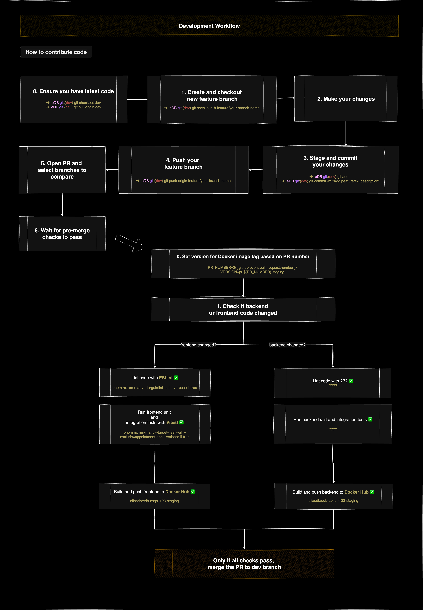

# eDB

## Table of Contents

-   [1. Project Goal](#1-project-goal)
-   [2. Setup](#2-setup)
    -   [2.1 Frontend](#21-frontend)
        -   [2.1.1 Tools and Features](#211-tools-and-features)
        -   [2.1.2 Portal and Platform Pages](#212-portal-and-platform-pages)
        -   [2.1.3 Shared Libraries](#213-shared-libraries)
        -   [2.1.4 Architecture Diagrams](#214-architecture-diagrams)
    -   [2.2 Backend](#22-backend)
        -   [2.2.1 Tools and Features](#221-tools-and-features)
        -   [2.2.2 Controllers and Endpoints](#222-controllers-and-endpoints)
            -   [2.2.2.1 Admin Controller](#2221-admin-controller)
            -   [2.2.2.2 Applications Controller](#2222-applications-controller)
            -   [2.2.2.3 Authentication Controller](#2223-authentication-controller)
            -   [2.2.2.4 Profile Controller](#2224-profile-controller)
        -   [2.2.3 Architecture Diagram](#223-architecture-diagram)
    -   [2.3 Database](#23-database)
    -   [2.4 VPS](#24-vps)
        -   [2.4.1 What is a VPS?](#241-what-is-a-vps)
        -   [2.4.2 Setting up a VPS with Hetzner](#242-setting-up-a-vps-with-hetzner)
            -   [Step 0: Setting up your account](#step-0-setting-up-your-account)
            -   [Step 1: Configure server on Hetzner](#step-1-configure-server-on-hetzner)
            -   [Step 2: Generating an SSH key](#step-2-generating-an-ssh-key)
            -   [Step 3: Retrieving the public key](#step-3-retrieving-the-public-key)
            -   [Step 4: Volumes](#step-4-volumes)
            -   [Step 5: Cloud config and server name](#step-5-cloud-config-and-server-name)
    -   [2.5 Project Management and Documentation](#24-project-management-and-documentation)
        -   [2.5.1 Jira](#251-jira)
        -   [2.5.1 Confluence](#252-confluence)
-   [3. Environments](#3-environments)
    -   [3.1 Development](#31-development)
        -   [3.1.1 Architecture Diagram](#311-architecture-diagram)
        -   [3.1.2 Spinning up a cluster locally](#312-spinning-up-a-cluster-locally)
            -   [Step 0: Prerequisites](#step-0-prerequisites)
            -   [Step 1: Create and start a k3d cluster](#step-1-create-and-start-a-k3d-cluster)
            -   [Step 2: Create Dockerfiles for Your Services](#step-2-create-dockerfiles-for-your-services)
            -   [Step 3: Create Kubernetes Manifests](#step-3-create-kubernetes-manifests)
            -   [Step 4: Configure Skaffold](#step-4-configure-skaffold)
            -   [Step 5: Run Skaffold for Local Development](#step-5-run-skaffold-for-local-development)
        -   [3.1.3 Development Workflow](#313-development-workflow)
    -   [3.2 Staging](#32-staging)
        -   [3.2.1 Deploying to staging](#321-deploying-to-staging)
        -   [3.2.2 Pipeline diagram](#322-pipeline-diagram)
    -   [3.3 Production](#33-production)
        -   [3.3.1 Pre-merge pipeline main branch](#331-pre-merge-pipeline-main-branch)
        -   [3.3.2 Deploying to production](#332-deploying-to-production)
        -   [3.3.3 Dockerfiles](#333-dockerfiles)
        -   [3.3.4 Architecture Diagram](#334-architecture-diagram)
-   [4. Handy Commands Cheat Sheet](#4-handy-commands-cheat-sheet)
    -   [4.1 General Commands](#41-general-commands)
    -   [4.2 Database Management Commands](#42-database-management-commands)
-   [5. Achieved Goals](#5-achieved-goals)

---

## 1. Project Goal

I am building a platform housing multiple applications where users can make an account and subscribe to the apps and launch them.

## 2. Setup

### 2.1 Frontend

### 2.1.1 Tools and Features

-   Framework: **Angular 19**
-   Monorepo workspace: **Nx**
-   Documenting components: **Storybook 8**
-   API Integration: **TanStack Query** to efficiently fetch and manage data from the backend REST API.
-   Role-Based Access Control (RBAC): User, Premium User, Admin with **JWT**
-   Application Modularity: **Lazy-loading** sub-applications and routes within the platform for improved performance and scalability.

### 2.1.2 Portal And Platform Pages

#### User Account:

-   Login and registration page.
-   Profile page for updates, account deletion, and preference management.

#### Admin Panel:

-   Admin page to manage users and potentially revoke their subscriptions.
-   Separate view more page for every user.

#### Catalog:

-   Catalog page to browse applications.

#### My eDB:

-   Dashboard to manage and launch subscribed applications.

### 2.1.3 Shared Libraries

**UI Library**: Built using **Carbon Design System**. Provides reusable components such as buttons, modals, and input fields to ensure consistent design across applications.

-   Current amount of components: 21

**Utils Library**: Contains shared utility functions, services, and helpers to promote DRY (Don't Repeat Yourself) principles.

-   Current shared utils:
    -   Form utils service
    -   Modal utils service
    -   Table utils service
    -   Auth Interceptor

### 2.1.4 Architecture Diagrams


### 2.2 Backend

### 2.2.1 Tools and Features

-   Frameworks: **.NET 8** with **Entity Framework**
-   Architecture: **REST API**
-   Role-Based Access Control (RBAC): User, Premium User, Admin with **JWT**

### 2.2.2 Controllers and Endpoints

### 2.2.2.1 Admin Controller

### **Admin Area**

-   **URL**: `GET /api/admin/area`
-   **Authorization**: Admin
-   **Description**: Check access to the admin area.
-   **Response**:
    ```json
    "Welcome, Admin!"
    ```

### **Get Users with Pagination, Sorting, and Search**

-   **URL**: `GET /api/admin/users`
-   **Authorization**: Admin
-   **Query Parameters**:
    -   `cursor` (optional): Cursor for pagination.
    -   `sort` (optional): Sorting parameter in the format `field,direction` (e.g., `id,asc`).
    -   `search` (optional): Search query.
-   **Description**: Fetch a paginated, sorted list of users with optional search.
-   **Response**:
    ```json
    {
        "data": [
            {
                "id": 1,
                "firstName": "John",
                "lastName": "Doe",
                "email": "john.doe@example.com"
            }
        ],
        "nextCursor": "next_cursor_value",
        "hasMore": true
    }
    ```

### **Get User by ID**

-   **URL**: `GET /api/admin/users/{userId}`
-   **Authorization**: Admin
-   **Description**: Fetch details of a user by their ID.
-   **Response**:
    ```json
    {
        "id": 1,
        "firstName": "John",
        "lastName": "Doe",
        "email": "john.doe@example.com"
    }
    ```

### **Delete User**

-   **URL**: `DELETE /api/admin/users/{userId}`
-   **Authorization**: Admin
-   **Description**: Delete a user by their ID.
-   **Response**:
    ```json
    {
        "Message": "User deleted successfully."
    }
    ```

### **Get Applications Overview**

-   **URL**: `GET /api/admin/applications-overview`
-   **Authorization**: Admin
-   **Description**: Fetch an overview of all applications, including subscription data.
-   **Response**:
    ```json
    [
        {
            "ApplicationId": 1,
            "ApplicationName": "App1",
            "SubscriberCount": 10,
            "SubscribedUsers": [
                {
                    "UserId": 1,
                    "UserName": "John Doe",
                    "UserEmail": "john.doe@example.com",
                    "SubscriptionDate": "2024-12-14T12:34:56Z"
                }
            ]
        }
    ]
    ```

### **Add Application**

-   **URL**: `POST /api/admin/applications/create`
-   **Authorization**: Admin
-   **Description**: Add a new application.
-   **Request Body**:
    ```json
    {
        "name": "App1",
        "description": "Description of App1",
        "iconUrl": "https://example.com/icon.png",
        "routePath": "/app1",
        "tags": ["tag1", "tag2"]
    }
    ```
-   **Response**:
    ```json
    {
        "id": 1,
        "name": "App1",
        "description": "Description of App1",
        "iconUrl": "https://example.com/icon.png",
        "routePath": "/app1",
        "tags": ["tag1", "tag2"]
    }
    ```

### **Update Application**

-   **URL**: `PUT /api/admin/applications/{applicationId}`
-   **Authorization**: Admin
-   **Description**: Update an application.
-   **Request Body**:
    ```json
    {
        "name": "Updated App Name",
        "description": "Updated description",
        "iconUrl": "https://example.com/updated-icon.png",
        "routePath": "/updated-app",
        "tags": ["updatedTag"]
    }
    ```
-   **Response**:
    ```json
    {
        "Message": "Application updated successfully."
    }
    ```

### **Revoke Subscription**

-   **URL**: `DELETE /api/admin/applications/{applicationId}/subscriptions/{userId}`
-   **Authorization**: Admin
-   **Description**: Revoke a user's subscription to an application.
-   **Response**:
    ```json
    {
        "Message": "Subscription revoked successfully."
    }
    ```

### **Delete Application**

-   **URL**: `DELETE /api/admin/applications/{applicationId}`
-   **Authorization**: Admin
-   **Description**: Delete an application by its ID.
-   **Response**:
    ```json
    {
        "Message": "Application deleted successfully."
    }
    ```

---

### 2.2.2.2 Applications Controller

### **Get Applications**

-   **URL**: `GET /api/applications`
-   **Description**: Fetch a list of all applications.
-   **Response**:
    ```json
    [
        {
            "id": 1,
            "name": "App1",
            "description": "Description of App1"
        }
    ]
    ```

### **Subscribe/Unsubscribe to Application**

-   **URL**: `POST /api/applications/subscribe`
-   **Description**: Subscribe or unsubscribe to an application based on current subscription status.
-   **Request Body**:
    ```json
    {
        "applicationId": 1
    }
    ```
-   **Response**:
    ```json
    {
        "message": "Subscribed successfully."
    }
    ```

### **Get User's Applications**

-   **URL**: `GET /api/applications/user`
-   **Description**: Fetch applications subscribed to by the authenticated user.
-   **Response**:
    ```json
    [
        {
            "id": 1,
            "name": "App1",
            "description": "Description of App1"
        }
    ]
    ```

---

### 2.2.2.3 Authentication Controller

### **Register**

-   **URL**: `POST /api/auth/register`
-   **Description**: Register a new user.
-   **Request Body**:
    ```json
    {
        "email": "john.doe@example.com",
        "password": "password123",
        "firstName": "John",
        "lastName": "Doe"
    }
    ```
-   **Response**:
    ```json
    {
        "message": "Registration successful."
    }
    ```

### **Login**

-   **URL**: `POST /api/auth/login`
-   **Description**: Authenticate a user and generate a JWT token.
-   **Request Body**:
    ```json
    {
        "email": "john.doe@example.com",
        "password": "password123"
    }
    ```
-   **Response**:
    ```json
    {
        "message": "Login successful.",
        "token": "jwt_token_here"
    }
    ```

---

### 2.2.2.4 Profile Controller

### **Get Profile Settings**

-   **URL**: `GET /api/profile/settings`
-   **Authorization**: User/Admin
-   **Description**: Fetch the profile settings of the authenticated user.
-   **Response**:
    ```json
    {
        "email": "john.doe@example.com",
        "firstName": "John",
        "lastName": "Doe"
    }
    ```

### **Update Profile**

-   **URL**: `PUT /api/profile/update`
-   **Authorization**: User/Admin
-   **Description**: Update profile settings for the authenticated user.
-   **Request Body**:
    ```json
    {
        "firstName": "John",
        "lastName": "Doe"
    }
    ```
-   **Response**:
    ```json
    {
        "message": "Profile updated successfully."
    }
    ```

### 2.2.3 Architecture Diagram


---

### 2.3 Database

**Database**: PostgreSQL

---

### 2.4 VPS

#### 2.4.1 What is a VPS?

A **Virtual Private Server (VPS)** is a virtualized environment that provides dedicated resources on a shared physical server. It offers a balance between cost, performance, and control, making it a popular choice for hosting applications and services.

##### Key Features of a VPS

-   **Dedicated Resources**: Allocated CPU, RAM, and storage that are exclusive to your VPS.
-   **Root Access**: Full control over the server to customize it as needed.
-   **Performance Isolation**: Other users on the same physical server do not impact your performance.
-   **Scalability**: Easily upgrade or downgrade resources based on your needs.
-   **Cost-Effective**: More affordable than a dedicated server, with similar customization and isolation benefits.

> **Note:** While the physical hardware is shared, the virtualization layer ensures resource isolation and predictable performance.

### 2.4.2 Setting up a VPS with Hetzner

### Step 0: Setting up your account

-   Create an account on [Hetzner](https://accounts.hetzner.com/signUp).

-   Navigate to your [account section](https://console.hetzner.cloud/projects).

### Step 1: Configure server on Hetzner

Under the 'Servers' tab you should find a button to add a server to your account. Let's go over the easy steps first needed to configure our server. It's pretty straight forward.


You will need to set

-   #### Location

    Location of server.
    

-   #### Image OS:

    This project runs on Ubuntu.
    

-   #### Type:

    I'm on shared ARM64 vCPUs.
    

-   #### Networking:

    

### Step 2: Generating an SSH key


Run following command on your machine:

`ssh-keygen -t rsa -b 4096 -C "your_email@example.com" -f /path/to/your/custom_key_name`

-   **-t rsa**: Specifies the type of key (RSA).
-   **-b 4096**: Sets the key size to 4096 bits for better security.
-   **-C "your_email@example.com"**: Adds a comment, typically your email address.
-   **-f /path/to/your/custom_key_name**: Specifies the file path and name for the key.

You can add an optional passphrase. Skip or add one for more security.

### Step 3: Retrieving the public key

After generating the key, the private key will be at /path/to/your/custom_key, and the public key will be at /path/to/your/custom_key.pub.

To retrieve the public key:
`cat /path/to/your/custom_key.pub`
Copy the output to use in your cloud-config or in the setup of the server as seen below here.


### Step 4: Volumes

You can add volumes to store data. This is needed if you want the data of your database to be persistent.

### Step 5: Cloud config and server name

Cloud-init is a powerful tool used for automating the initial setup and configuration of cloud servers during their first boot.
[This article](https://community.hetzner.com/tutorials/basic-cloud-config) takes you step by step in the setup of a cloud-init script. The script will handle users set up, SSH keys and permissions, install packages, run custom scripts, configure firewalls or securing SSH.

### 2.5 Project Management and Documentation

#### 2.5.1 Jira

Jira is used as a central tool to organize, track, and manage work. It supports various issue types for different kinds of work items, helps structure tasks under epics, and facilitates agile sprint planning and execution.

---

#### 2.5.1.1 Issue Types

Jira provides different issue types to categorize work, each serving a unique purpose. Understanding these types helps in organizing and managing issues effectively:

**Epics:**

-   **Purpose:** Large bodies of work that can be broken down into smaller tasks (stories, tasks, spikes).
-   **Usage:** In this project, four main epics categorize all work:
    -   **Project Management:** Organizing work, planning sprints, refining backlog items, and improving management processes.
    -   **Frontend:** Focusing on user interface, user experience, data visualization, responsiveness, testing, and code quality improvements.
    -   **Backend:** Pertaining to API development, code refactoring, testing, architectural decisions, and infrastructure improvements.
    -   **DevOps:** Covering CI/CD pipelines, server management, security, infrastructure automation, and related research (spikes) for deployment tools and strategies.

**Stories:**

-   **Purpose:** Represent user-centric features or requirements from an end-user’s perspective.
-   **Usage:** Capture specific functionalities or enhancements that deliver value to users. For example: “As an admin, I want to see graphs on the dashboard so that I can analyze data trends easily.”

**Tasks:**

-   **Purpose:** Represent technical or operational work that doesn’t directly translate into a user feature but is necessary for project progress.
-   **Usage:** Used for maintenance, setup, refactoring, and other work items like “Setup My First Sprint” or “Refactor Goals and Unresolved Questions into Jira Tickets.”

**Spikes:**

-   **Purpose:** Time-boxed research or investigation tasks to explore solutions, reduce uncertainty, or gather information.
-   **Usage:** Used for exploring best practices, evaluating new tools, or researching architectural approaches. Spikes are labeled as such for easy identification.

---

#### 2.5.1.2 Setting Up a Sprint


**1. Prepare Your Backlog:**  
Ensure that your backlog is prioritized and contains refined stories, tasks, and spikes linked to their respective epics.

**2. Create a New Sprint:**  
Navigate to the **Backlog** view on your Scrum board and click on **“Create sprint”** at the top of the backlog. A new sprint container will appear, ready to be populated with issues.

**3. Select Issues for the Sprint:**  
Drag and drop high-priority issues from the backlog into the new sprint container. Choose issues that align with the sprint goal and team capacity, maintaining a balance of feature development, technical tasks, and research activities.

**4. Define Sprint Goals and Timeline:**  
Optionally, edit the sprint details to set a clear sprint goal that describes what you aim to achieve. Set start and end dates, and determine the sprint duration.

**5. Start the Sprint:**  
Once the sprint is populated and goals are defined, click **“Start sprint”**. Jira automatically creates a Scrum board for the sprint if one isn’t already configured. This board visualizes the sprint backlog, in-progress tasks, and completed work.

---

#### 2.5.1.3 Working with the Jira Board During a Sprint

-   **Automatic Board Creation:**  
    When a sprint is started, Jira generates a Scrum board that reflects the sprint’s issues. The board typically includes columns (e.g., To Do, In Progress, Done) that represent the workflow stages.

-   **Using the Board:**

    -   **Visualize Progress:** Team members can drag issues across columns as work progresses.
    -   **Daily Standups:** Use the board during standups to discuss what’s in progress, what’s completed, and identify blockers.
    -   **Update Issues:** Team members update issue statuses, log work, and add comments directly on the board to keep everyone informed.

-   **Completing the Sprint:**  
    At the end of the sprint, review completed work on the board. Use Jira’s **“Complete sprint”** feature to close the sprint, move unfinished tasks back to the backlog or the next sprint, and plan for future sprints.

#### 2.5.2 Confluence

I intend to migrate this README to Confluence pages. More on this at a later time.
This is the URL to the space there: https://metanoi4.atlassian.net/wiki/spaces/eDB/overview (only visible if you are part of the team)

## 3. Environments

### 3.1 Development

I am using **k3d**, which wraps my **k3s** Kubernetes distribution inside **Docker** containers. **k3s** is a lightweight Kubernetes distribution that allows me to orchestrate containers for scalable application deployment. I use **Skaffold** to manage my Kubernetes manifests, build Docker images and deploy them to my local k3d cluster. Skaffold also pulls any configured images, such as **PostgreSQL** and **Adminer**, enabling a complete local development environment.

#### 3.1.1 Architecture Diagram


#### 3.1.2 Spinning up a cluster locally

##### Step 0: Prerequisites

If you want to run this project locally, make sure you have the following installed:

1. **Docker**:  
   Download and install Docker from [https://www.docker.com/products/docker-desktop](https://www.docker.com/products/docker-desktop).

2. **k3d**:  
   Install k3d, a lightweight wrapper for running k3s in Docker.  
   Installation guide: [https://k3d.io/#installation](https://k3d.io/#installation)

    For example, using `brew` on macOS:

    ```bash
    brew install k3d
    ```

3. **kubectl**:  
   Install `kubectl`, the Kubernetes CLI tool, to manage the cluster.  
   Installation guide: [https://kubernetes.io/docs/tasks/tools/](https://kubernetes.io/docs/tasks/tools/)

4. **Skaffold**:  
   Download and install Skaffold for managing Kubernetes manifests and local development.  
   Installation guide: [https://skaffold.dev/docs/install/](https://skaffold.dev/docs/install/)

    For example, using `brew` on macOS:

    ```bash
    brew install skaffold
    ```

##### Step 1: Create and start a k3d cluster

Create a new k3d cluster and specify ports to expose the services running inside the cluster. These ports will be accessible from your host machine.

**Command to create the cluster:**

```bash
k3d cluster create mycluster --port "3200:3200@loadbalancer" --port "9101:9101@loadbalancer"
```

**Command to start the cluster:**

```bash
k3d cluster start mycluster
```

##### Step 2: Create Dockerfiles for Your Services

Create a `Dockerfile` for each service (e.g., `frontend` and `backend`).

##### Step 3: Create Kubernetes Manifests

Create Kubernetes manifests for all resources required by your application. These should include:

-   **Deployments**: Define how your frontend and backend applications will run, including resource limits and replicas.
-   **Services**: Expose your applications as `ClusterIP` or `LoadBalancer` types.
-   **ConfigMaps**: Store environment variables and other configurations.
-   **Secrets**: Store sensitive data securely (e.g., database credentials).
-   **Persistent Volumes (PVs) and Persistent Volume Claims (PVCs)**: Handle storage for services like PostgreSQL.

Ensure your manifests include the necessary annotations to work with k3d's local LoadBalancer and any ingress controllers you may use.

##### Step 4: Configure Skaffold

Create a `skaffold.yaml` file to manage your local development setup. This file defines how Skaffold will build, push, and deploy your services. Like where your Dockerfiles or Kubernetes manifests are located.

##### Step 5: Run Skaffold for Local Development

Use **Skaffold** to build and deploy your services automatically:

**Command:**

```bash
skaffold dev
```

This command will:

-   Build Docker images using your `Dockerfiles`.
-   Apply your Kubernetes manifests to the cluster.
-   Monitor your source code for changes and redeploy the services when updates are detected.

Once deployed, your frontend will be available at `http://localhost:4200` and your backend at `http://localhost:9101`. You can access these services via a browser or tools like Postman.

#### 3.1.3 Development Workflow

When you are able to spin up the cluster and access the frontend and backend, you are ready to contribute if you wish. Below is a visual representation of this workflow. You basically create a branch, make changes, open a PR and wait for checks to pass. After checks pass you can then merge to dev branch.



### 3.2 Staging

#### 3.2.1 Deploying to staging


After all checks pass and you have merged successfully, a pipeline will run deploying the build to a staging environment that mimics production.

**URLs**:

-   https://app.staging.eliasdebock.com
-   https://api.staging.eliasdebock.com

#### 3.2.2 Pipeline Diagram


### 3.3 Production

After you merged to the dev branch, you can proceed to make another PR. This time to push to production, to merge with the main branch. A pre-merge pipeline will run doing some checks again. After those pass you can merge to main branch.

#### 3.3.1 Pre-merge pipeline main branch


#### 3.3.2 Deploying to production

When you have all checks passed, you can then click the button to merge to main branch. This will trigger the final pipeline to deploy to production.


#### 3.3.3 Dockerfiles

These are the multi-stage Dockerfiles used in production for my frontend and backend.


#### 3.3.4 Architecture Diagram

This is my current production cluster. When the pipeline runs to deploy it's actually updating these deployments here with a new Docker image or it rolls back if that does not go as planned. My domain was bought and configured at CloudFlare to point to the IP of my VPS. To configure different URLS, I had to add a A record to my settings at Cloudflare that point to the public IPv4 address of my VPS.


## 4. Handy Commands Cheat Sheet

### 4.1 General Commands

| Command                                                          | Description                                  |
| ---------------------------------------------------------------- | -------------------------------------------- |
| `kubectl get services`                                           | List all services in the cluster             |
| `kubectl get pods`                                               | List all running pods                        |
| `kubectl describe pod <pod-name>`                                | Get detailed information on a specific pod   |
| `kubectl logs <pod-name>`                                        | View logs for a specific pod                 |
| `kubectl port-forward svc/<service> <local-port>:<service-port>` | Forward a port for local access to a service |
| `kubectl delete pod <pod-name>`                                  | Delete a specific pod (it will be restarted) |
| `kubectl apply -f <filename>.yaml`                               | Apply a YAML configuration to the cluster    |
| `kubectl delete -f <filename>.yaml`                              | Delete resources defined in a YAML file      |
| `k3d cluster create <name>`                                      | Create a new K3s cluster                     |
| `k3d cluster delete <name>`                                      | Delete an existing K3s cluster               |
| `skaffold dev`                                                   | Start Skaffold in development mode           |
| `skaffold run`                                                   | Deploy the application to the cluster        |
| `skaffold delete`                                                | Remove all Skaffold-managed resources        |

### 4.2 Database Management Commands

| Command                                                 | Description                                                           |
| ------------------------------------------------------- | --------------------------------------------------------------------- |
| `kubectl port-forward svc/<postgres-service> 5432:5432` | Forward PostgreSQL service to localhost for local access              |
| `psql -h localhost -p 5432 -U <username> -d <database>` | Connect to PostgreSQL database locally                                |
| `CREATE DATABASE <database>;`                           | Create a new database inside PostgreSQL                               |
| `\l`                                                    | List all databases                                                    |
| `\c <database>`                                         | Switch to a specific database                                         |
| `\dt`                                                   | List all tables in the current database                               |
| `kubectl get pods -n <namespace>`                       | Check if the database pod is running                                  |
| `kubectl logs <pod-name> -n <namespace>`                | View logs for the database pod to troubleshoot issues                 |
| `dotnet ef migrations add <MigrationName>`              | Create a new migration to modify the database schema                  |
| `dotnet ef database update`                             | Apply migrations to update the database schema                        |
| `kubectl delete pod <postgres-pod-name> -n <namespace>` | Restart the PostgreSQL pod if it’s stuck or needs to be reinitialized |
| `SELECT pg_terminate_backend(pg_stat_activity.pid)`     | Terminate connections to a specific database (see below for full SQL) |

---

## 5. Achieved Goals

-   [x] Development environment (k3s cluster using k3d managed with Skaffold)
-   [x] Staging environment (k3s cluster on VPS)
-   [x] Production environment (k3s cluster on VPS)
-   [x] CI/CD pipelines for production and staging, with pre-merge checks and post-merge deployment (self-hosted ARM Github Actions runner on VPS).
-   [x] Documentation
