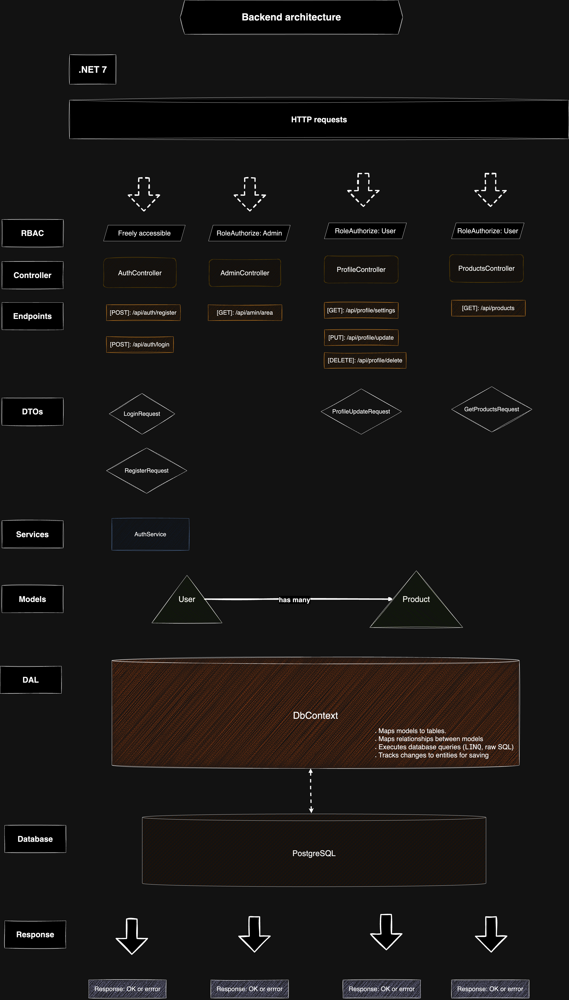

# eDB

## Project Overview

This is a platform for showcasing a range of applications.

---

### Setup

-   **Frontend**:

    -   **Tools**: **Angular 18**, managed within an **Nx** workspace.
    -   **Platform Application Features**:
        -   **User Management**:
            -   Login and registration.
            -   Profile updates, account deletion, and preference management.
        -   **Role-Based Access Control (RBAC)**:
            -   User roles: User, Premium User, Admin.
            -   Conditional access to sub-applications based on roles and feature flags (to be implemented).
        -   **Application Modularity**:
            -   Lazy-loading sub-applications for improved performance and scalability.
        -   **API Integration**:
            -   Utilizes **TanStack Query** to efficiently fetch and manage data from the backend REST API.
    -   **Shared Libraries**:
        -   **UI Library**:
            -   Built using **Carbon Design System**.
            -   Provides reusable components such as buttons, modals, and input fields to ensure consistent design across applications.
        -   **Utils Library**:
            -   Contains shared utility functions, services, and helpers to promote DRY (Don't Repeat Yourself) principles.
    -   **Storybook**:
        -   Used to document and visually test components from the shared UI library, ensuring consistency and reusability across the platform.

-   **Backend**:

    -   **Tools**: .NET 7 with Entity Framework.
    -   **Features**: REST API for platform services, user management, and role-based access.

-   **Database**: PostgreSQL

---

### Infrastructure

-   **Docker**: Manages containerized versions of the frontend, backend, and database.
-   **Kubernetes (K3s)**: Provides container orchestration for scalable application deployment.
    -   **kubectl**: Command-line tool for managing Kubernetes resources.
    -   **K3d**: Manages K3s clusters within Docker for lightweight local clusters.
    -   **Skaffold**: Handles continuous development workflows with Kubernetes.

---

### Application Architecture Diagrams


## Nx and Angular Architecture


## .NET architecture



---

### K3s Handy Commands Cheat Sheet

#### General Commands

| Command                                                          | Description                                  |
| ---------------------------------------------------------------- | -------------------------------------------- |
| `kubectl get services`                                           | List all services in the cluster             |
| `kubectl get pods`                                               | List all running pods                        |
| `kubectl describe pod <pod-name>`                                | Get detailed information on a specific pod   |
| `kubectl logs <pod-name>`                                        | View logs for a specific pod                 |
| `kubectl port-forward svc/<service> <local-port>:<service-port>` | Forward a port for local access to a service |
| `kubectl delete pod <pod-name>`                                  | Delete a specific pod (it will be restarted) |
| `kubectl apply -f <filename>.yaml`                               | Apply a YAML configuration to the cluster    |
| `kubectl delete -f <filename>.yaml`                              | Delete resources defined in a YAML file      |
| `k3d cluster create <name>`                                      | Create a new K3s cluster                     |
| `k3d cluster delete <name>`                                      | Delete an existing K3s cluster               |
| `skaffold dev`                                                   | Start Skaffold in development mode           |
| `skaffold run`                                                   | Deploy the application to the cluster        |
| `skaffold delete`                                                | Remove all Skaffold-managed resources        |

#### Database Management Commands

| Command                                                 | Description                                                           |
| ------------------------------------------------------- | --------------------------------------------------------------------- |
| `kubectl port-forward svc/<postgres-service> 5432:5432` | Forward PostgreSQL service to localhost for local access              |
| `psql -h localhost -p 5432 -U <username> -d <database>` | Connect to PostgreSQL database locally                                |
| `CREATE DATABASE <database>;`                           | Create a new database inside PostgreSQL                               |
| `\l`                                                    | List all databases                                                    |
| `\c <database>`                                         | Switch to a specific database                                         |
| `\dt`                                                   | List all tables in the current database                               |
| `kubectl get pods -n <namespace>`                       | Check if the database pod is running                                  |
| `kubectl logs <pod-name> -n <namespace>`                | View logs for the database pod to troubleshoot issues                 |
| `dotnet ef migrations add <MigrationName>`              | Create a new migration to modify the database schema                  |
| `dotnet ef database update`                             | Apply migrations to update the database schema                        |
| `kubectl delete pod <postgres-pod-name> -n <namespace>` | Restart the PostgreSQL pod if it’s stuck or needs to be reinitialized |
| `SELECT pg_terminate_backend(pg_stat_activity.pid)`     | Terminate connections to a specific database (see below for full SQL) |

---

### Quick Reference SQL for Database Issues

#### Terminate Connections to Drop the Database

If you need to drop the database but connections are preventing it, use this SQL:

```sql
SELECT pg_terminate_backend(pg_stat_activity.pid)
FROM pg_stat_activity
WHERE pg_stat_activity.datname = '<database>'
  AND pid <> pg_backend_pid();
```
