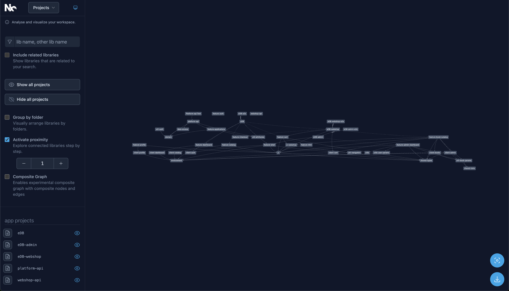
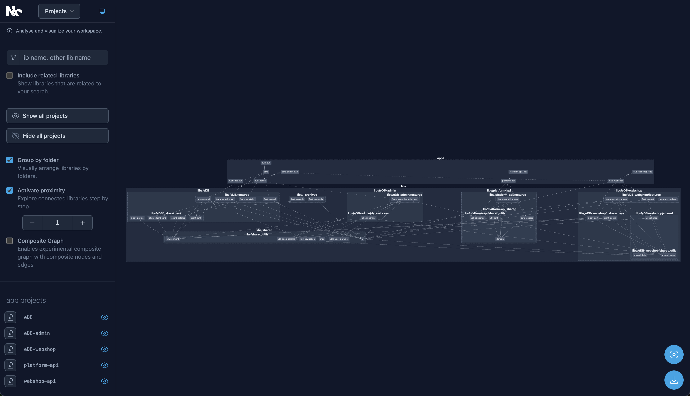

### API

### Stack & Architecture

**Platform API**

-   **Frameworks**: **.NET 8**
-   **ORM**: **Entity Framework**
-   **Object Mapper**: **Automapper** is a library for .NET that automatically maps data between objects, eliminating the need for manual property assignments.
-   **Testing**: **xUnit** and **Moq** for unit and integration testing
-   **Architecture**: **REST API**

**Webshop API**

-   **Frameworks**: **Laravel 11**
-   **ORM**: **Doctrine**
-   **Architecture**: **REST API**

### APIs

#### **Platform API**

The **Platform API** serves as the backbone for all core functionalities, providing endpoints for application management and user subscriptions.

##### **Endpoints**

###### **Applications**

-   **Get Applications**

    -   **URL**: `GET /api/applications`
    -   **Description**: Fetch a list of all applications.
    -   **Response:**
        ```json
        [
        	{
        		"id": 1,
        		"name": "App1",
        		"description": "Description of App1"
        	}
        ]
        ```

-   **Subscribe/Unsubscribe to Application**

    -   **URL**: `POST /api/applications/subscribe`
    -   **Description**: Subscribe or unsubscribe to an application based on current subscription status.
    -   **Request Body:**
        ```json
        {
        	"applicationId": 1
        }
        ```
    -   **Response:**
        ```json
        {
        	"message": "Subscribed successfully."
        }
        ```

-   **Get User's Applications**
    -   **URL**: `GET /api/applications/user`
    -   **Description**: Fetch applications subscribed to by the authenticated user.
    -   **Response:**
        ```json
        [
        	{
        		"id": 1,
        		"name": "App1",
        		"description": "Description of App1"
        	}
        ]
        ```

###### **Admin**

This part handles administrative tasks, including user management, application CRUD operations, and subscription management.

###### **Application Management**

-   **Get Applications Overview**

    -   **URL**: `GET /api/admin/applications`
    -   **Authorization**: Admin
    -   **Description**: Fetch an overview of all applications, including subscription data.
    -   **Response:**
        ```json
        [
        	{
        		"ApplicationId": 1,
        		"ApplicationName": "App1",
        		"SubscriberCount": 10,
        		"SubscribedUsers": [
        			{
        				"UserId": 1,
        				"UserName": "John Doe",
        				"UserEmail": "john.doe@example.com",
        				"SubscriptionDate": "2024-12-14T12:34:56Z"
        			}
        		]
        	}
        ]
        ```

-   **Add Application**

    -   **URL**: `POST /api/admin/applications`
    -   **Authorization**: Admin
    -   **Description**: Add a new application.
    -   **Request Body:**
        ```json
        {
        	"name": "App1",
        	"description": "Description of App1",
        	"iconUrl": "https://example.com/icon.png",
        	"routePath": "/app1",
        	"tags": ["tag1", "tag2"]
        }
        ```
    -   **Response:**
        ```json
        {
        	"id": 1,
        	"name": "App1",
        	"description": "Description of App1",
        	"iconUrl": "https://example.com/icon.png",
        	"routePath": "/app1",
        	"tags": ["tag1", "tag2"]
        }
        ```

-   **Update Application**

    -   **URL**: `PUT /api/admin/applications/{applicationId}`
    -   **Authorization**: Admin
    -   **Description**: Update an application.
    -   **Request Body:**
        ```json
        {
        	"name": "Updated App Name",
        	"description": "Updated description",
        	"iconUrl": "https://example.com/updated-icon.png",
        	"routePath": "/updated-app",
        	"tags": ["updatedTag"]
        }
        ```
    -   **Response:**
        ```json
        {
        	"Message": "Application updated successfully."
        }
        ```

-   **Revoke Subscription**

    -   **URL**: `DELETE /api/admin/applications/{applicationId}/subscriptions/{userId}`
    -   **Authorization**: Admin
    -   **Description**: Revoke a user's subscription to an application.
    -   **Response:**
        ```json
        {
        	"Message": "Subscription revoked successfully."
        }
        ```

-   **Delete Application**
    -   **URL**: `DELETE /api/admin/applications/{applicationId}`
    -   **Authorization**: Admin
    -   **Description**: Delete an application by its ID.
    -   **Response:**
        ```json
        {
        	"Message": "Application deleted successfully."
        }
        ```

#### **Webshop API**

##### Book API

-   **List books**

    -   **URL**: `GET /api/v1/books`
    -   **Authorization**: None
    -   **Description**: Retrieves a paginated list of books with optional filtering.
    -   **Query Parameters**:
        -   `page_size` (integer, optional) - Number of books per page (default: 15).
        -   `offset` (integer, optional) - Offset for pagination (default: 0).
        -   `limit` (integer, optional) - Maximum number of books to return (default: page size).
        -   `status` (string, optional) - Filter books by status (`loaned`).
    -   **Response:**
        ```json
        {
        	"data": {
        		"items": [
        			{
        				"id": 1,
        				"title": "Book Title",
        				"author": "Author Name",
        				"status": "available"
        			}
        		],
        		"count": 100,
        		"hasMore": true,
        		"offset": 0,
        		"limit": 15
        	}
        }
        ```

-   **Add a book**

    -   **URL**: `POST /api/v1/books`
    -   **Authorization**: None
    -   **Description**: Creates a new book entry.
    -   **Request Body:**
        ```json
        {
        	"title": "New Book",
        	"author": "Author Name",
        	"status": "available"
        }
        ```
    -   **Response:**
        ```json
        {
        	"id": 1,
        	"title": "New Book",
        	"author": "Author Name",
        	"status": "available"
        }
        ```

-   **Get a Single Book**

    -   **URL**: `GET /api/v1/books/{bookId}`
    -   **Authorization**: None
    -   **Description**: Retrieves details of a specific book.
    -   **Response:**
        ```json
        {
        	"id": 1,
        	"title": "Book Title",
        	"author": "Author Name",
        	"status": "available"
        }
        ```

-   **Update a Book**

    -   **URL**: `PUT /api/v1/books/{bookId}`
    -   **Authorization**: None
    -   **Description**: Updates the details of a book.
    -   **Request Body:**
        ```json
        {
        	"title": "Updated Book Title",
        	"author": "Updated Author Name",
        	"status": "loaned"
        }
        ```
    -   **Response:** `204 No Content`

-   **Delete a Book**
    -   **URL**: `DELETE /api/v1/books/{bookId}`
    -   **Authorization**: None
    -   **Description**: Deletes a book from the database.
    -   **Response:**
        ```json
        {
        	"message": "Book deleted successfully."
        }
        ```

---

##### Cart API

-   **Get User Cart**

    -   **URL**: `GET /api/v1/cart`
    -   **Authorization**: Requires user authentication (`jwt_user_id`)
    -   **Description**: Retrieves the cart of the authenticated user.
    -   **Response:**
        ```json
        {
        	"id": 1,
        	"user_id": 123,
        	"items": [
        		{
        			"id": 1,
        			"book_id": 10,
        			"selected_amount": 2,
        			"price": 19.99,
        			"book": {
        				"title": "Book Title",
        				"author": "Author Name"
        			}
        		}
        	]
        }
        ```

-   **Add Item to Cart**

    -   **URL**: `POST /api/v1/cart`
    -   **Authorization**: Requires user authentication (`jwt_user_id`)
    -   **Description**: Adds a book to the user's cart.
    -   **Request Body:**
        ```json
        {
        	"id": 10,
        	"selected_amount": 2
        }
        ```
    -   **Response:**
        ```json
        {
        	"id": 1,
        	"user_id": 123,
        	"items": [
        		{
        			"id": 1,
        			"book_id": 10,
        			"selected_amount": 2,
        			"price": 19.99
        		}
        	]
        }
        ```

-   **Remove Item from Cart**

    -   **URL**: `DELETE /api/v1/cart/{itemId}`
    -   **Authorization**: Requires user authentication (`jwt_user_id`)
    -   **Description**: Removes an item from the user's cart.
    -   **Response:**
        ```json
        {
        	"message": "Item removed successfully."
        }
        ```

-   **Update Item in Cart**
    -   **URL**: `PUT /api/v1/cart/{itemId}`
    -   **Authorization**: Requires user authentication (`jwt_user_id`)
    -   **Description**: Updates the quantity of an item in the cart.
    -   **Request Body:**
        ```json
        {
        	"selectedAmount": 3
        }
        ```
    -   **Response:**
        ```json
        {
        	"id": 1,
        	"user_id": 123,
        	"items": [
        		{
        			"id": 1,
        			"book_id": 10,
        			"selected_amount": 3,
        			"price": 19.99
        		}
        	]
        }
        ```

### Architecture Diagrams

[**V1: Monolithic Platform API**](./backend/backend-architecture_v2.png)
The first model of the platform using a familiar monolithic approach.

**V2: Layered Modular Platform API and Admin API**
This is a visual representation of the workspace dependency graph regarding backend as is right now. This is a more layered modular approach. Refactored Controllers and Services into feature-libs, abstracted the Repositories and DbContext also into its own layer... Basically tried to also think more in terms of layers that depend on each other and get some structure going here too. Also took the first step towards separate Platform and Admin API.


> **Tip:** Run `nx graph` to see the full dependency graph. Which looks like this:



