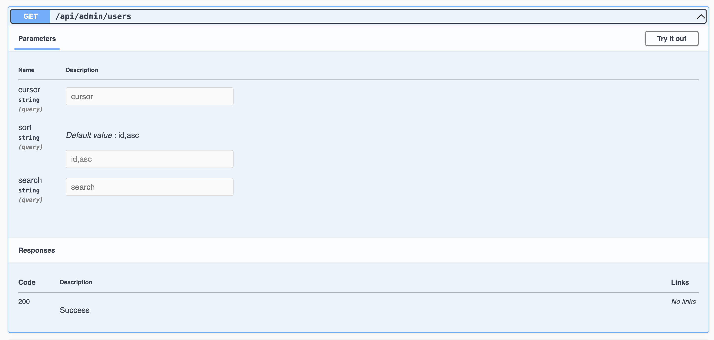
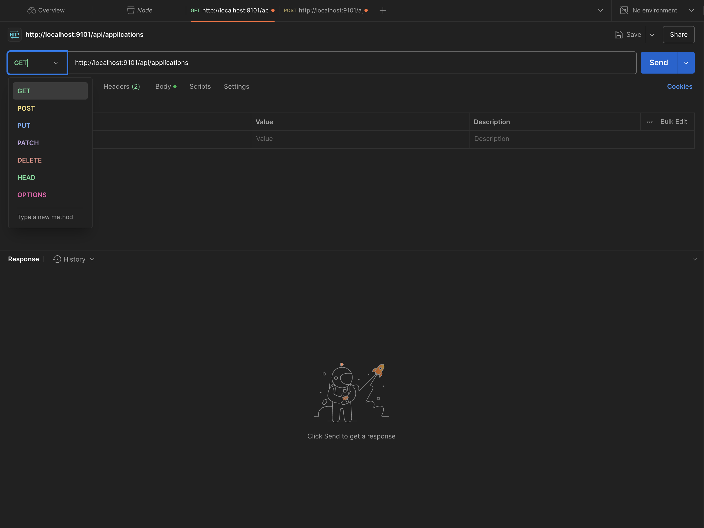
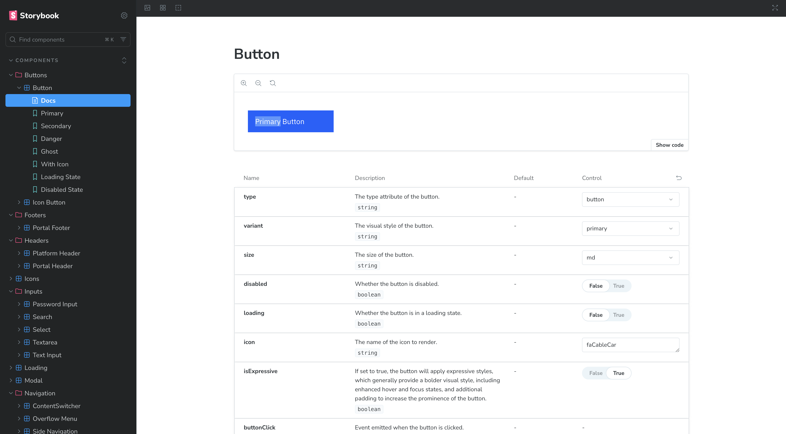

### 4.1 Development

#### 4.1.1 Setup

##### **Local k3s Cluster (k3d + Skaffold)**

> **Note:** This is the first setup I ever created for development on my local machine. Is outdated now.

The project is using **k3d**, which wraps my **k3s** Kubernetes distribution inside **Docker** containers. **k3s** is a lightweight Kubernetes distribution that allows me to orchestrate containers for scalable application deployment. I use **Skaffold** to manage my Kubernetes manifests, build Docker images and deploy them to my local k3d cluster. Skaffold also pulls any configured images, such as **PostgreSQL** and **Adminer**, enabling a complete local development environment.

**Spinning up a cluster locally**

##### Step 0: Prerequisites

If you want to run this project locally, make sure you have the following installed:

1. **Docker**:  
   Download and install Docker from [https://www.docker.com/products/docker-desktop](https://www.docker.com/products/docker-desktop).

2. **k3d**:  
   Install k3d, a lightweight wrapper for running k3s in Docker.  
   Installation guide: [https://k3d.io/#installation](https://k3d.io/#installation)

    For example, using `brew` on macOS:

    ```bash
    brew install k3d
    ```

3. **kubectl**:  
   Install `kubectl`, the Kubernetes CLI tool, to manage the cluster.  
   Installation guide: [https://kubernetes.io/docs/tasks/tools/](https://kubernetes.io/docs/tasks/tools/)

4. **Skaffold**:  
   Download and install Skaffold for managing Kubernetes manifests and local development.  
   Installation guide: [https://skaffold.dev/docs/install/](https://skaffold.dev/docs/install/)

    For example, using `brew` on macOS:

    ```bash
    brew install skaffold
    ```

##### Step 1: Create and start a k3d cluster

Create a new k3d cluster and specify ports to expose the services running inside the cluster. These ports will be accessible from your host machine.

**Command to create the cluster:**

```bash
k3d cluster create mycluster --port "3200:3200@loadbalancer" --port "9101:9101@loadbalancer"
```

**Command to start the cluster:**

```bash
k3d cluster start mycluster
```

##### Step 2: Create Dockerfiles for Your Services

Create a `Dockerfile` for each service (e.g., `frontend` and `backend`).

##### Step 3: Create Kubernetes Manifests

Create Kubernetes manifests for all resources required by your application. These should include:

-   **Deployments**: Define how your frontend and backend applications will run, including resource limits and replicas.
-   **Services**: Expose your applications as `ClusterIP` or `LoadBalancer` types.
-   **ConfigMaps**: Store environment variables and other configurations.
-   **Secrets**: Store sensitive data securely (e.g., database credentials).
-   **Persistent Volumes (PVs) and Persistent Volume Claims (PVCs)**: Handle storage for services like PostgreSQL.

Ensure your manifests include the necessary annotations to work with k3d's local LoadBalancer and any ingress controllers you may use.

##### Step 4: Configure Skaffold

Create a `skaffold.yaml` file to manage your local development setup. This file defines how Skaffold will build, push, and deploy your services. Like where your Dockerfiles or Kubernetes manifests are located.

##### Step 5: Run Skaffold for Local Development

Use **Skaffold** to build and deploy your services automatically:

**Command:**

```bash
skaffold dev
```

This command will:

-   Build Docker images using your `Dockerfiles`.
-   Apply your Kubernetes manifests to the cluster.
-   Monitor your source code for changes and redeploy the services when updates are detected.

Once deployed, your frontend will be available at `http://localhost:4200` and your backend at `http://localhost:9101`. You can access these services via a browser or tools like Postman.

Here is a diagram of the setup:


##### **[NEW] Nx development setup**

However I did not like rebuilding images all the time and even though it went smooth to set up staging and production because I had a pretty similar setup on my own machine. I simplified the dev setup after refactoring my backend to be included in the Nx workspace.

```
  "scripts": {
    "start:web": "nx serve eDB",
    "start:admin": "nx serve eDB-admin --port 4300",
    "start:platform-api": "nx serve platform-api",
    "start:webshop": "nx serve eDB-webshop",
    "start:webshop-api": "nx serve webshop-api",
  },
```

Running these scripts with pnpm (e.g. `pnpm start:web`) will start up either the platform app, the admin app, webshop app, Webshop API or the Platform API. Can be extended with more as the platform grows. You will have to setup a local db which is easily done through your terminal and through the Postgres App.

#### 4.1.2 Tools

These are some of the tools I use when developing locally:

##### PgAdmin 4

Text to be added.


##### Swagger

You can find the Swagger API docs at: `http://localhost:5098/swagger/index.html`. Which gives you a nice overview of all endpoints, models and DTOs. You can also try out the endpoints here.




##### Postman

I use Postman to test my endpoints in isolation. [Installation link](https://www.postman.com/downloads).



##### XUnit and Moq

I use XUnit and Moq to do unit and integration testing.


##### Storybook

You can find the Storybook overview by running: `nx storybook ui`. You will get a nice overview of all components at `http://localhost:4400/`.



##### Vitest

I use Vitest to do unit and integration testing in frontend.


##### Prettier

I use Prettier to test my endpoints in isolation.

##### ESLint

I use ESLint to test my endpoints in isolation.
